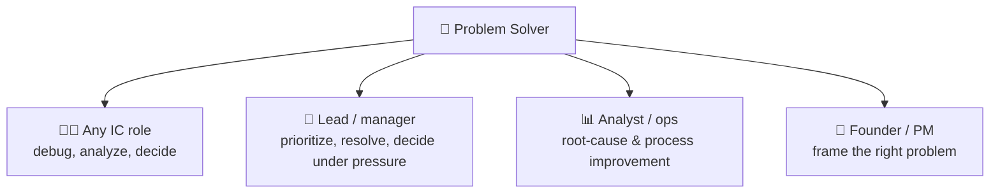

# 🗺️ Skills Map — *Problem Solver*

How earning this badge updates a learner's **skills map** and why it's one of the highest-leverage
credentials to hold — problem solving is a near-universal job requirement.

> Concept reference: [`../../specs/skills-map-job-matching.md`](../../specs/skills-map-job-matching.md).

---

## 🧩 What the badge writes to the skills map

On issuance, these KSA components are recorded with evidence and level:

| Component | Type | Level | Evidence |
| --------- | ---- | ----- | -------- |
| `K-process` — the problem-solving process | 🧠 Knowledge | L2 | Atom 1 quiz |
| `K-decisions-biases` — decisions & biases | 🧠 Knowledge | L2 | Atom 2 quiz |
| `S-frame` — define & decompose | 🛠️ Skill | **L2** | Atom 3 performance task + capstone |
| `S-root-cause` — root cause analysis | 🛠️ Skill | **L2** | Atom 4 performance task + capstone |
| `S-solutions` — generate & choose solutions | 🛠️ Skill | L2 | Atom 5 + capstone |
| `A-persistence` — persistence & ambiguity tolerance | 🌱 Ability | L2 | Behavioral, ≥3 occasions |
| `A-critical-curious` — critical, curious thinking | 🌱 Ability | L2 | Behavioral, ≥3 occasions |

---

## 🎯 Why this badge matters everywhere

"Problem-solving skills" appears in the majority of job postings across functions. Unlike most badges
that boost one role, **Problem Solver is a multiplier** on nearly every role's effectiveness and is
frequently an explicit hiring criterion (O\*NET lists Complex Problem Solving, Critical Thinking, and
Judgment & Decision Making as core skills across occupations).

---

## 🧭 How it fits a learning pathway

| Stage | Credential | What it adds |
| ----- | ---------- | ------------ |
| Foundational (cognitive) | 🏅 **Problem Solver** *(this one)* | define, diagnose, decide |
| Pairs well with | 🏅 [Self-Learning](../self-learning-micro-credential/skills-map.md) | fill the knowledge gaps a problem reveals |
| Pairs well with | 🏅 [Effective Communication](../effective-communication-micro-credential/skills-map.md) | explain & sell the chosen solution |
| Pairs well with | 🏅 [Growth Mindset](../growth-mindset-micro-credential/skills-map.md) | persist when the first solution fails |
| Builds toward | *Data Analysis · Systems Thinking · Decision Science* | (future credentials) advanced problem work |
| Role pathways | *Analyst · Engineer · Operations · Product Manager · Consultant · Founder* | problem solving is core to each |

> **Job-matching note:** because problem solving is a *transversal* competency, this badge rarely
> appears alone in a role's minimums — it **stacks** with technical badges (e.g.,
> [Python Variables](../python-variables-micro-credential/skills-map.md) → developer pathway) to make a
> candidate credible end-to-end. Matching against a specific job's minimum bar still requires **human
> (mentor/employer) validation** — AI-suggested mappings are a starting point, not a verdict (see
> [`../../CLAUDE.md`](../../CLAUDE.md) §5).
