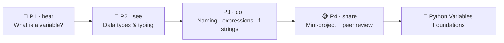

# 🐍 Worked Example — Python Variables Micro-Credential (full course)

  
  
  
  

A **complete, ready-to-run ADA micro-credential** for an absolute-beginner technical skill:
**using variables in Python**. It is a *fully populated* example built end-to-end with the ADA
Methodology (KSA + 4 phases + learning-atom topology): every atom has **real reading text**,
**curated video links**, **runnable code**, **Mermaid diagrams**, **image-generation prompts**,
practice codelabs, and rubrics.

> 🖥️ **See it live:** open [`course.html`](course.html) in any browser for an interactive,
> navigable version of this course (sidebar, progress, embedded videos, diagrams, copyable code).

This is the **basic/technical counterpart** to the
[Growth Mindset micro-credential](../growth-mindset-micro-credential/README.md) (a durable
*Ability*). Together they show ADA covering the full KSA spectrum — a small *Knowledge* base, two
hands-on *Skills*, and a supporting *Ability* (attention to detail / a debugging mindset).

Conforms to [`../../specs/micro-credential-v2-schema.md`](../../specs/micro-credential-v2-schema.md) ·
modalities from [`../../specs/learning-atom-topology.md`](../../specs/learning-atom-topology.md) ·
KSA from [`../../specs/ksa-taxonomy.md`](../../specs/ksa-taxonomy.md).

---

## 🧭 What this teaches

A **variable** is the first thing anyone writes in any programming language — and the first place
beginners get stuck (naming, types, `=` vs `==`, "why is my number a string?"). This course makes
that foundational skill **trainable and certifiable**: learners build an accurate mental model of
what a variable *is*, learn Python's core data types and dynamic typing, then **write real code**
to declare, name, reassign, combine, and convert values — finishing with a small program they ship
and peer-review.

| | |
| --- | --- |
| **Title** | Python Variables: Store, Name & Use Data |
| **Duration** | ~6 hours · 1–2 weeks (beginner) |
| **Primary KSA** | 🛠️ Skill — *declare, name, and use variables* in real Python |
| **Target competency** | SFIA **PROG** (programming/software development, level 1–2) · O\*NET 15-1251/15-1252 (Programmers / Software Developers) · ESCO *"use a programming language / Python"* |
| **Badge** | 🏅 *Python Variables Foundations* |
| **Prerequisites** | None. Just Python 3 (or a free online runner like replit.com / Google Colab). |

---

## 📚 Course contents

| # | File | What it is |
| - | ---- | ---------- |
| — | [`micro-credential.md`](micro-credential.md) | The full micro-credential spec (YAML schema, objectives, KSA map, phase planner) |
| 1 | [`atoms/atom-1-what-is-a-variable.md`](atoms/atom-1-what-is-a-variable.md) | 🙉 P1 · 🧠 K — What is a variable? (name → value, the label mental model) |
| 2 | [`atoms/atom-2-data-types.md`](atoms/atom-2-data-types.md) | 🙈 P2 · 🧠 K — Core data types & dynamic typing (`int`, `float`, `str`, `bool`) |
| 3 | [`atoms/atom-3-naming-and-assignment-codelab.md`](atoms/atom-3-naming-and-assignment-codelab.md) | 🙊 P3 · 🛠️ S — Naming & assignment codelab (PEP 8, reassign, swap) |
| 4 | [`atoms/atom-4-expressions-conversion-fstrings-codelab.md`](atoms/atom-4-expressions-conversion-fstrings-codelab.md) | 🙊 P3 · 🛠️ S — Expressions, type conversion & f-strings codelab |
| 5 | [`atoms/atom-5-mini-project-capstone.md`](atoms/atom-5-mini-project-capstone.md) | 🐵 P4 · 🛠️ S + 🌱 A — Mini-project: a receipt/profile program + peer review |
| — | [`labs.md`](labs.md) | 🧪 Runnable code + **unit tests** + `main()` runners for every codelab |
| — | [`labs/`](labs/) | The actual `.py` files: `profile_card.py`, `tip_calculator.py`, `receipt.py` (+ `test_*.py`) |
| — | [`capstone.md`](capstone.md) | Capstone brief + how it maps to KSA |
| — | [`rubrics.md`](rubrics.md) | All rubrics (knowledge-mini, skill, code-quality, capstone-5) |
| — | [`skills-map.md`](skills-map.md) | Badge → skills map and how it starts a developer pathway |

> 🧪 **Runnable & verified:** every codelab is backed by a real `.py` module with a `main()` and a
> `unittest` file. Run them all with `cd labs && python3 -m unittest discover -v`.

---

## 🔄 Phase journey

---

## 🤖 How it was authored (and how to reuse it)

This course follows the Gen AI authoring workflow in
[`../../specs/genai-authoring-workflow.md`](../../specs/genai-authoring-workflow.md):
job competency → KSA → atoms → modalities → rubrics → badge. Conventions used throughout:

- **🎬 Videos** are written as a `youtube` block with the real URL + a caption (the interactive
  site embeds them as a click-to-play player).
- **🖼️ Diagrams** are provided two ways: a live **Mermaid** diagram *and* a reusable
  **image-generation prompt** in a `prompt` block — feed it to any image model for an on-brand asset.
- **💻 Code** is shown in fenced `python` blocks so it renders (and copies) cleanly.

> ⚠️ **Human-in-the-loop (methodology guardrail):** the external links and references below are
> **curated starting points**. A mentor/instructor should verify each link, licensing, and
> currency before delivery — AI-suggested sources are never authoritative on their own. See
> [`../../CLAUDE.md`](../../CLAUDE.md) §5.
