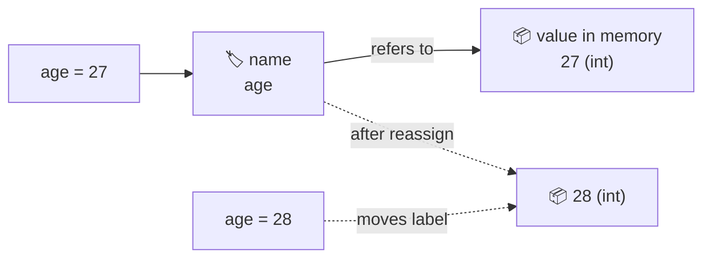

## ⚛ Learning Atom 1 — *What Is a Variable?*

**Phase:** 🙉 1 · Self-Guided Introduction (*hear*) · **KSA:** 🧠 Knowledge · **Target level:** L1
· **Component id:** `K-var-concept`

### 🎯 Learning objective

- **Explain** what a variable is in Python — a *name* bound to a *value* — and describe the
  "label on a box" mental model, including what dynamic typing means.

### 🧩 Prerequisites

- None. If you can open [replit.com](https://replit.com) or Google Colab and run one line of
  Python, you're ready.

### 🧭 Atom description

Every program is just data plus the steps that transform it. A **variable** is how you give a
piece of data a *name* so you can refer to it later. Get this mental model right and the rest of
programming gets dramatically easier; get it fuzzy and you'll fight your code for weeks. This atom
builds the model on purpose, before you write much code.

---

### 📖 Reading — *A name for a value* (≈ 5 min)

> Author: ADA Methodology · aligned with the official Python tutorial.

A **variable** is a **name that refers to a value**. In Python you create one with a single `=`,
the *assignment* operator:

```python
age = 27
name = "Ada"
price = 19.99
is_open = True
```

Read `age = 27` as *"let the name `age` refer to the value `27`"* — **not** "age equals 27" like
in math. The `=` does something: it points a label at a value. A useful mental model is a **label
stuck on a box**: the value `27` lives in memory (the box), and `age` is a label you put on it. To
get the value back, you just use the name:

```python
print(age)          # 27
print(name)         # Ada
print(age + 3)      # 30
```

You can **reassign** a variable any time — move the label to a different box:

```python
age = 27
age = 28            # the name 'age' now refers to 28; the old 27 is forgotten
```

Two ideas that trip up beginners:

- **`=` is not `==`.** A single `=` *assigns* (puts a label on a value). A double `==` *compares*
  (asks "are these equal?", giving `True`/`False`). Using one for the other is the classic first bug.
- **Python is dynamically typed.** You never declare a type; Python figures out the type from the
  value, and a name can later point to a value of a different type. (More in Atom 2.)

```python
x = 5        # x refers to an integer
x = "five"   # totally legal — x now refers to a string
```

Finally, a name on its own — before you assign anything — does **not** exist. Using it raises a
`NameError`. A variable must be *assigned before it is used*:

```python
print(score)   # NameError: name 'score' is not defined
score = 0      # fix: define it first
```

**Key takeaways**

- [ ] A variable is a **name bound to a value** (a label on a box).
- [ ] `=` **assigns**; `==` **compares** — they are different.
- [ ] You can **reassign** a name at any time.
- [ ] Python is **dynamically typed** — the value decides the type, not a declaration.
- [ ] Use a name only **after** assigning it, or you get a `NameError`.

---

### 🎬 Watch — Variables in Python (pick one, ~6–10 min)

```youtube
https://www.youtube.com/watch?v=cQT33yu9pY8
Programming with Mosh — "Python Variables" (clear beginner walkthrough).
```

```youtube
https://www.youtube.com/watch?v=Z1Yd7upQsXY
BroCode — "Python variables for beginners" (short, hands-on).
```

---

### 🖼️ See — Mental model: *a label pointing at a value*



A reusable prompt to generate an on-brand version of this diagram:

```prompt
Create a clean, modern educational infographic titled "A Variable = a Label on a Value".
Show a hand sticking a luggage-style tag labeled "age" onto a cardboard box that contains the
number "27". Add a small caption "age = 27  →  the name 'age' refers to the value 27". To the
right, show the same tag being moved onto a second box containing "28" with caption
"age = 28  →  reassigned". Use ADA brand colors (Indigo #1E2A6E, Turquoise #15B5C6, Gold #E0A53C
accents) on a light background, flat vector style, generous white space, legible sans-serif,
no photoreal faces. 16:9.
```

---

### ✅ Evaluate — Pop quiz (formative, `knowledge-mini`)

Answer, then check yourself against the key.

1. In `total = 100`, what exactly does the `=` do?
2. What is the difference between `=` and `==`?
3. After `x = 5` then `x = "hi"`, what does `x` refer to — and is that allowed in Python?
4. What error do you get if you `print(count)` before assigning `count`?

<details>
<summary>Answer key</summary>

1. It **assigns**: it binds the name `total` to the value `100` (points the label at the box).
2. `=` assigns a value to a name; `==` compares two values and returns `True`/`False`.
3. `x` refers to the string `"hi"`. Yes — Python is dynamically typed, so a name can point to a
   value of a different type later.
4. A `NameError` ("name 'count' is not defined") — a variable must be assigned before use.

</details>

---

### 📦 Deliverable

- In an online runner, create three variables about *yourself* (e.g. `name`, `age`,
  `favorite_language`), `print` them, then reassign one and print again. Paste the code + output.

### 🧠 Final reflection

- The "label on a box" model is one way to picture variables. Where might that picture mislead
  you later (hint: what happens with two names pointing at the *same* list)? Jot a guess to revisit.

### 🔗 Sources to verify (human-in-the-loop)

- Python official tutorial — *An Informal Introduction to Python* (docs.python.org/3/tutorial).
- Python docs — *Execution model / naming and binding*.
- Al Sweigart, *Automate the Boring Stuff with Python*, Ch. 1 (free online).

### 🧩 Connections

- **Successors:** Atom 2 (data types), Atom 3 (start declaring & naming for real).
