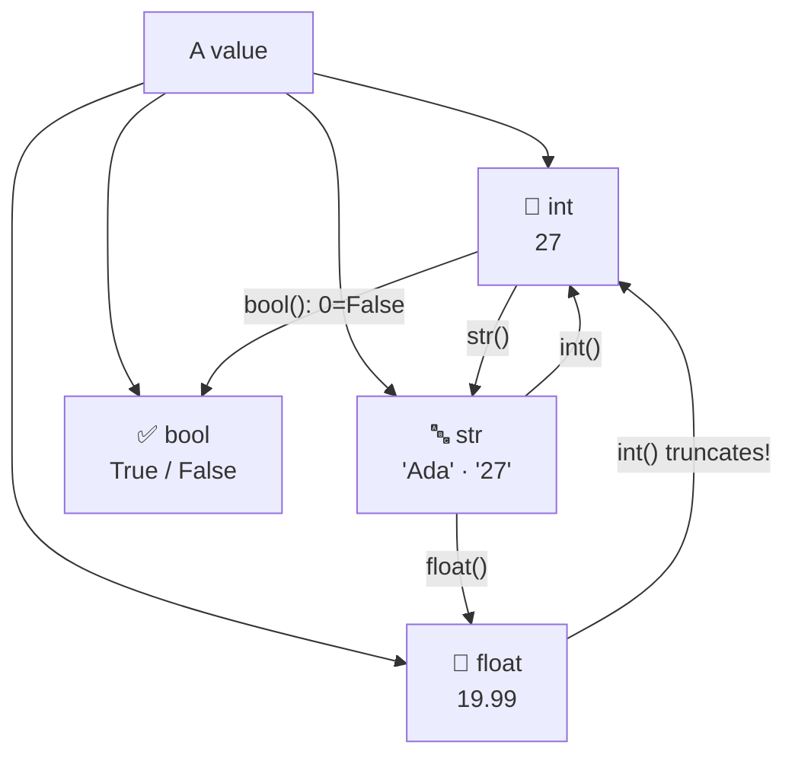

## ⚛ Learning Atom 2 — *Data Types & Dynamic Typing*

**Phase:** 🙈 2 · Visual Exploration (*see*) · **KSA:** 🧠 Knowledge · **Target level:** L2
· **Component id:** `K-data-types`

### 🎯 Learning objective

- **Identify** Python's core built-in data types (`int`, `float`, `str`, `bool`), predict what
  `type()` returns, and explain how and why values get converted.

### 🧩 Prerequisites

- Atom 1 (you know a variable is a name bound to a value).

### 🧭 Atom description

A value isn't just "data" — it has a **type**, and the type decides what you can *do* with it.
`3 + 4` is `7`, but `"3" + "4"` is `"34"`. Most beginner bugs are really *type* bugs in disguise.
This atom gives you the four types you'll use constantly and the rules for moving between them.

---

### 📖 Reading — *The four types you'll use every day* (≈ 6 min)

> Author: ADA Methodology · aligned with the official Python tutorial.

Every value in Python has a **type**. You can always ask with the built-in `type()`:

```python
type(27)        # <class 'int'>
type(19.99)     # <class 'float'>
type("Ada")     # <class 'str'>
type(True)      # <class 'bool'>
```

The four core built-in types for beginners:

| Type | Means | Examples | Note |
| ---- | ----- | -------- | ---- |
| `int` | whole number | `0`, `27`, `-4` | no decimal point |
| `float` | decimal number | `19.99`, `3.0`, `-0.5` | the `.` makes it a float |
| `str` | text ("string") | `"Ada"`, `'hi'`, `"27"` | quotes — single or double |
| `bool` | truth value | `True`, `False` | capital T/F; a kind of int under the hood |

**Why type matters:** the same operator behaves differently by type.

```python
3 + 4            # 7      (int + int = arithmetic)
"3" + "4"        # "34"   (str + str = joining, called concatenation)
"ha" * 3         # "hahaha" (str * int = repeat)
3 + "4"          # TypeError: unsupported operand type(s) — can't add int and str
```

That last error is the most common beginner surprise, and it usually comes from **input**:
anything a user types with `input()` arrives as a **string**, even if it looks like a number.

```python
age = input("Age? ")   # user types 27 → age is the STRING "27"
age + 1                 # 💥 TypeError: can only concatenate str to str
```

The fix is **type conversion** (also called *casting*) — turn a value into another type with the
type's name as a function:

```python
int("27")        # 27      (str → int)
float("19.99")   # 19.99   (str → float)
str(27)          # "27"    (int → str)
int(19.99)       # 19      (float → int, truncates — it does NOT round)
bool(0)          # False   (0, "", and empty things are "falsy")
bool(42)         # True
```

So the input fix is to convert first:

```python
age = int(input("Age? "))   # now age is the number 27
print(age + 1)              # 28 ✅
```

Two nuances worth holding onto:

- **`int()` on a float truncates**, it does not round: `int(19.99)` is `19`. Use `round(19.99)`
  for `20`.
- A conversion can **fail**: `int("hello")` raises a `ValueError`. The value must actually look
  like the target type.

**Key takeaways**

- [ ] Four core types: `int`, `float`, `str`, `bool`; check any value with `type()`.
- [ ] `+` adds numbers but **joins** strings — type changes the behavior.
- [ ] `input()` always returns a **string** — convert before doing math.
- [ ] Convert with `int()`, `float()`, `str()`, `bool()`; `int()` **truncates** floats.
- [ ] A bad conversion raises a `ValueError`.

---

### 🎬 Watch — Data types & type conversion (short)

```youtube
https://www.youtube.com/watch?v=khKv-8q7YmY
Telusko — "Python data types" (quick tour of int/float/str/bool).
```

---

### 🖼️ See — Diagram: *types and how they convert*



A reusable prompt to generate an on-brand version of this diagram:

```prompt
Create a clean, modern educational infographic titled "Python's Core Types & Conversions".
Show four labeled tiles: "int 27", "float 19.99", "str 'Ada'", "bool True/False", each with a
small icon (hash for int, decimal for float, quotation marks for str, checkmark for bool). Draw
arrows between them labeled with the conversion functions int(), float(), str(), and note
"int() truncates" on the float→int arrow and "input() always returns str" as a caption. Use ADA
brand colors (Indigo #1E2A6E, Turquoise #15B5C6, Gold #E0A53C accents) on a light background,
flat vector style, high contrast, legible monospace for code, no photoreal elements. 16:9.
```

---

### ✅ Evaluate — Pop quiz (formative, `knowledge-mini`)

1. What is `type(19.99)`? What is `type("19.99")`?
2. What does `"3" + "4"` produce, and why?
3. A user runs `n = input("Number? ")` and types `5`. What type is `n`, and how do you safely
   compute `n * 2` as a number?
4. What is `int(19.99)` — and how is that different from `round(19.99)`?

<details>
<summary>Answer key</summary>

1. `type(19.99)` → `float`; `type("19.99")` → `str` (quotes make it text).
2. `"34"` — `+` between two strings **concatenates** (joins) them; it does not add.
3. `n` is a **string** `"5"`. Convert first: `int(n) * 2` → `10`.
4. `int(19.99)` is `19` — it **truncates** (drops the decimals). `round(19.99)` is `20`.

</details>

---

### 📦 Deliverable

- Write a 5-line script that takes two numbers via `input()`, converts them, and prints their sum
  *and* their concatenation-as-strings — so you can see the difference. Paste code + output.

### 🧠 Final reflection

- Which conversion surprised you most? Predict one real bug this knowledge will save you from.

### 🔗 Sources to verify (human-in-the-loop)

- Python docs — *Built-in Types* and *Built-in Functions* (`int`, `float`, `str`, `bool`, `round`).
- Python official tutorial §3 — *Numbers, Strings*.
- Real Python — "Basic Data Types in Python" (verify currency).

### 🧩 Connections

- **Predecessors:** Atom 1. **Successors:** Atom 3 (naming & assignment), Atom 4 (use & convert).
