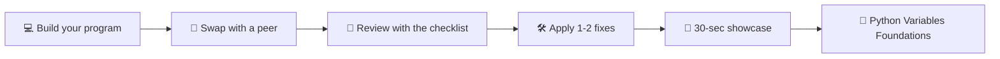

## ⚛ Learning Atom 5 — *Mini-Project: Ship a Program (Capstone)*

**Phase:** 🐵 4 · Collaboration & Reflection (*share*) · **KSA:** 🛠️ Skill + 🌱 Ability
· **Target level:** L2 · **Component ids:** `S-declare-assign`, `S-use-values`, `A-attention-detail`

### 🎯 Learning objective

- **Create** a small, working Python program that stores, converts, and prints data using
  variables — then **explain and peer-review** it.

### 🧩 Prerequisites

- Atoms 1–4.

### 🧭 Atom description

This is the capstone, delivered as a learning atom. You'll integrate everything — naming,
assignment, types, conversion, expressions, and f-strings — into one small program you actually
*ship*, then trade code with a peer for review. Shipping something tiny and correct, and being
able to talk through it, is exactly what an entry-level task looks like.

---

### 🚀 The brief

> Build a short program (**~15–30 lines**) that collects some inputs, computes something useful
> with variables, and prints a clean, formatted summary with f-strings.

Pick one (or invent your own at the same scope):

- **Receipt maker** — items, unit prices, quantities → subtotal, tax, total.
- **Profile card** — name, birth year, city, favorite language → a formatted "ID card".
- **Trip cost splitter** — total cost, nights, number of people → cost per person per night.
- **Unit converter** — e.g. km↔miles or °C↔°F using a formula and a constant.

### 📦 What to submit

- [ ] **The program** — logic in well-named functions (PEP 8), a `main()` runner, at least 3
  different types, at least one type conversion, and f-string output.
- [ ] **A unit test file** — at least **3 passing tests** (`python3 -m unittest` shows `OK`).
- [ ] **A sample run** — the input you gave and the printed output.
- [ ] **A 4–6 line README** — what it does, how to run it + how to run the tests, one improvement.
- [ ] **A peer review you gave** — using the checklist below, on a classmate's program.

### 🧱 Starter scaffold — *functions + `main()` + tests*

Structure the program so the logic is in **testable functions** and `main()` only handles I/O.
This is the shape professionals ship — and the only way you can write tests for it.

> 📁 Full runnable reference: [`../labs/receipt.py`](../labs/receipt.py) +
> [`../labs/test_receipt.py`](../labs/test_receipt.py).

```python
# receipt.py
TAX_RATE = 0.19                      # constant in UPPER_CASE

def subtotal(unit_price, quantity):
    return unit_price * quantity

def build_receipt(item_name, unit_price, quantity, rate=TAX_RATE):
    sub = subtotal(unit_price, quantity)
    tax = sub * rate
    total = sub + tax
    return (
        "----- RECEIPT -----\n"
        f"{item_name} x{quantity} @ ${unit_price:.2f}\n"
        f"Subtotal: ${sub:.2f}\n"
        f"Tax ({rate*100:.0f}%): ${tax:.2f}\n"
        f"TOTAL:    ${total:.2f}"
    )

def main():
    item_name = input("Item name? ")
    unit_price = float(input("Unit price? "))
    quantity = int(input("Quantity? "))
    print(build_receipt(item_name, unit_price, quantity))

if __name__ == "__main__":
    main()
```

```python
# test_receipt.py
import unittest
from receipt import subtotal, build_receipt

class TestReceipt(unittest.TestCase):
    def test_subtotal(self):
        self.assertAlmostEqual(subtotal(2.5, 4), 10.0)

    def test_build_receipt_has_item_and_total(self):
        r = build_receipt("Coffee", 3.0, 2, rate=0.0)
        self.assertIn("Coffee x2", r)
        self.assertIn("TOTAL:    $6.00", r)

if __name__ == "__main__":
    unittest.main()
```

```bash
python3 receipt.py                      # run the program
python3 -m unittest test_receipt.py     # prove it works → "OK"
```

---

### 🤝 Collaborate — pair review



**Peer-review checklist** (use it on your partner's code):

- [ ] Are all variable names valid, descriptive `snake_case`?
- [ ] Are there at least 3 different data types, and at least one conversion?
- [ ] Does it run without errors on a normal input?
- [ ] Is the output formatted clearly with f-strings?
- [ ] One concrete suggestion to make it better.

---

### 🎤 Showcase (30–60 seconds)

1. **What it does** (10s) — one sentence.
2. **One variable choice** (20s) — a name/type decision you made and why.
3. **One bug you hit** (20s) — what the error said and how you fixed it.
4. **One improvement** (10s) — what you'd add next.

---

### ✅ Evaluate — Capstone rubric (`capstone-5`)

Graded on the standard 5-criteria ADA capstone rubric in [`../rubrics.md`](../rubrics.md):
relevance, application of skills, problem-solving, clarity/communication, and
collaboration/reflection.

> **Badge pass:** program runs and meets the brief, capstone-5 weighted ≥ 60%, and the peer
> review + showcase are completed — **instructor-verified** (human-in-the-loop).

---

### 📦 Deliverable

- The program + sample run + mini-README + the peer review you gave. This is your portfolio piece.

### 🧠 Final reflection

- You started not knowing what `=` did. Write 3 sentences to a beginner explaining variables in
  your own words — teaching it is how you prove you learned it.

### 🔗 Sources to verify (human-in-the-loop)

- Python docs — *Input and Output* (f-strings, `print`).
- Al Sweigart, *Automate the Boring Stuff with Python* — first project chapters.

### 🧩 Connections

- **Predecessors:** Atoms 1–4. **Next pathway:** strings & lists → conditionals → loops (see
  [`../skills-map.md`](../skills-map.md) for where this badge leads).
