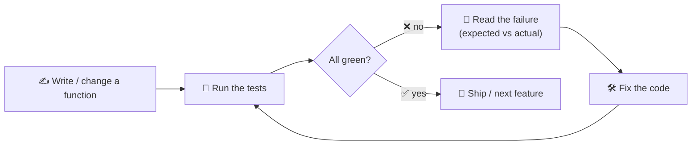

# 🧪 Labs & Tests — runnable code for the codelabs

Every codelab in this micro-credential ships as **real, runnable Python** with a `main()` to run
it and a **unit-test file** to prove it works. The files live in
[`labs/`](labs/) and are the source of truth — the snippets inside the atoms are excerpts of these.

> 🧠 **Why this matters (the method):** putting logic in small **functions** and verifying them
> with **unit tests** is exactly the *attention-to-detail / debugging* Ability (`A-attention-detail`)
> this course builds. Tests turn "I think it works" into "I can prove it works."

---

## ▶️ How to run everything

```bash
# from the course folder
cd labs

# run any program (it asks for input):
python3 profile_card.py
python3 tip_calculator.py
python3 receipt.py

# run a single test file:
python3 -m unittest test_tip_calculator.py

# run ALL tests at once (auto-discovers test_*.py):
python3 -m unittest discover -v
```

A green run looks like this:

```text
Ran 13 tests in 0.001s

OK
```

---

## 🔁 The test-driven loop (how to use the tests while you build)



> 🖼️ *Need a polished version of this diagram for slides? Use the prompt below in any
> image-generation model, then drop the result into a `labs/img/` folder and link it here.*

```prompt
Create a clean, modern flat-vector infographic of a "test-driven development loop" as a circular
arrow cycle with four labeled stations: 1) "Write a function" (pencil icon), 2) "Run the tests"
(play/terminal icon), 3) "Red — read the failure" (red dot, magnifier), 4) "Green — ship it"
(green check, rocket). Center label: "RED → GREEN → REFACTOR". Use ADA brand colors (Indigo
#1E2A6E, Turquoise #15B5C6, Gold #E0A53C accents) on a light background, legible sans-serif and a
monospace accent, high contrast, generous white space. 16:9.
```

---

## 📂 The files

| Atom | Program (`main()`) | Tests |
| ---- | ------------------ | ----- |
| 3 · Naming & assignment | [`labs/profile_card.py`](labs/profile_card.py) | [`labs/test_profile_card.py`](labs/test_profile_card.py) |
| 4 · Expressions & f-strings | [`labs/tip_calculator.py`](labs/tip_calculator.py) | [`labs/test_tip_calculator.py`](labs/test_tip_calculator.py) |
| 5 · Capstone | [`labs/receipt.py`](labs/receipt.py) | [`labs/test_receipt.py`](labs/test_receipt.py) |

### `profile_card.py` (Atom 3)

```python
def calculate_age(birth_year, current_year):
    return current_year - birth_year

def make_profile_card(name, birth_year, favorite_language, current_year):
    age = calculate_age(birth_year, current_year)
    return (
        "----- PROFILE -----\n"
        f"Name:     {name}\n"
        f"Age:      {age}\n"
        f"Codes in: {favorite_language}"
    )

def main():
    name = input("Name? ")
    birth_year = int(input("Birth year? "))
    favorite_language = input("Favorite language? ")
    print(make_profile_card(name, birth_year, favorite_language, 2026))

if __name__ == "__main__":
    main()
```

### `tip_calculator.py` (Atom 4)

```python
def calculate_tip(bill, tip_percent):
    return bill * tip_percent / 100

def grand_total(bill, tip_percent):
    return bill + calculate_tip(bill, tip_percent)

def per_person(total, people):
    if people <= 0:
        raise ValueError("people must be greater than 0")
    return total / people

def main():
    bill = float(input("Bill amount? "))
    tip_percent = int(input("Tip %? "))
    people = int(input("Split between how many? "))
    total = grand_total(bill, tip_percent)
    print(f"Grand total: ${total:.2f}")
    print(f"Each person pays: ${per_person(total, people):.2f}")

if __name__ == "__main__":
    main()
```

### `receipt.py` (Atom 5 capstone)

```python
TAX_RATE = 0.19

def subtotal(unit_price, quantity):
    return unit_price * quantity

def apply_tax(amount, rate=TAX_RATE):
    return amount * (1 + rate)

def build_receipt(item_name, unit_price, quantity, rate=TAX_RATE):
    sub = subtotal(unit_price, quantity)
    tax = sub * rate
    total = sub + tax
    return (
        "----- RECEIPT -----\n"
        f"{item_name} x{quantity} @ ${unit_price:.2f}\n"
        f"Subtotal: ${sub:.2f}\n"
        f"Tax ({rate*100:.0f}%): ${tax:.2f}\n"
        f"TOTAL:    ${total:.2f}"
    )

def main():
    item_name = input("Item name? ")
    unit_price = float(input("Unit price? "))
    quantity = int(input("Quantity? "))
    print(build_receipt(item_name, unit_price, quantity))

if __name__ == "__main__":
    main()
```

### Example test file — `test_tip_calculator.py`

```python
import unittest
from tip_calculator import calculate_tip, grand_total, per_person

class TestTipCalculator(unittest.TestCase):
    def test_calculate_tip(self):
        self.assertAlmostEqual(calculate_tip(100, 15), 15.0)

    def test_grand_total(self):
        self.assertAlmostEqual(grand_total(100, 15), 115.0)

    def test_per_person_splits_evenly(self):
        self.assertAlmostEqual(per_person(120, 4), 30.0)

    def test_per_person_rejects_zero_people(self):
        with self.assertRaises(ValueError):
            per_person(100, 0)

if __name__ == "__main__":
    unittest.main()
```

---

## ✅ Common assertions you'll use

| Assertion | Checks | Use for |
| --------- | ------ | ------- |
| `assertEqual(a, b)` | `a == b` | ints, strings, exact values |
| `assertAlmostEqual(a, b)` | `a ≈ b` | `float` math (avoids rounding traps) |
| `assertIn(x, text)` | `x in text` | a substring is present in output |
| `assertTrue(x)` / `assertFalse(x)` | truthiness | booleans / conditions |
| `assertRaises(Error)` | code raises | bad input is rejected safely |

> ⚠️ **Human-in-the-loop:** tests prove the code does what *you specified*. A mentor still checks
> that you specified the *right* behavior — green tests are necessary, not sufficient.
