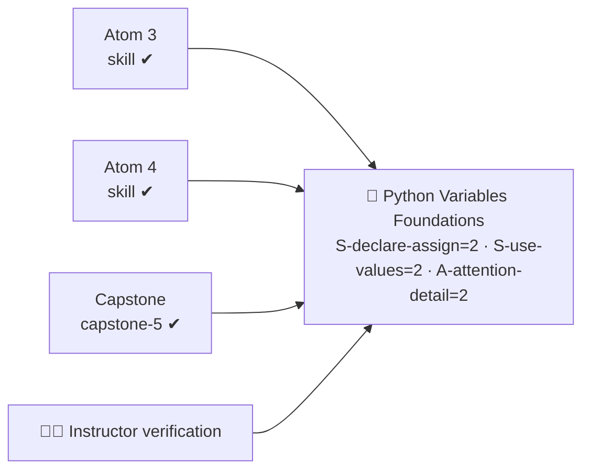

# 📊 Rubrics — Python Variables Micro-Credential

All assessment instruments used across the course. Atoms reference these by `rubric` flavor:
`knowledge-mini`, `skill`, `capstone-5` (plus a `code-quality` lens applied throughout).

---

## 🔹 `knowledge-mini` — concept checks (Atoms 1–2)

Quick formative check; used for the pop quizzes.

| Criterion | Excellent (3) | Adequate (2) | Needs improvement (1) |
| --------- | ------------- | ------------ | --------------------- |
| **Accuracy** | All answers correct; predicts `type()`/conversion results | Mostly correct | Repeats a misconception (e.g. `=` means `==`) |
| **Vocabulary** | Uses terms correctly (assign, type, convert, concatenate) | Roughly right | Vague / wrong terms |
| **Self-application** | Connects to own code example | Generic example | None |

> Pass = 2+ on each. Knowledge here is **L1–L2** — it enables the Skills that follow.

---

## 🔹 `skill` — performance mini-rubric (Atoms 3–4)

For the naming/assignment codelab and the expressions/conversion/f-strings codelab.

| Criterion | Excellent (3) | Adequate (2) | Needs improvement (1) |
| --------- | ------------- | ------------ | --------------------- |
| **Correct mechanics** | Assignment, reassignment, swap, expressions all work | Minor gaps | Code doesn't run |
| **Naming (PEP 8)** | All names valid, descriptive `snake_case` | Mostly good | Cryptic / invalid names |
| **Types & conversion** | Converts input correctly; right type everywhere | One slip | Type bugs unresolved |
| **Reads errors** | Diagnoses Syntax/Name/Type errors and fixes them | Fixes with hints | Guesses randomly |

> Pass = 2+ on each → **L2** evidence for the relevant Skill component.

---

## 🔹 `code-quality` — the attention-to-detail lens (applied across Atoms 3–5) ⭐

The lens that builds the **Ability** `A-attention-detail`. A habit, not a single moment — looked
for across the **3 assessed occasions** (two codelabs + the capstone).

| Criterion | Excellent (3) | Adequate (2) | Needs improvement (1) |
| --------- | ------------- | ------------ | --------------------- |
| **Readability** | Clear names, tidy layout, helpful comment where needed | Generally readable | Hard to follow |
| **Error handling habit** | Reads the error message and fixes the real cause | Fixes eventually | Ignores / works around |
| **Runs clean** | No errors on normal input across all occasions | Occasional slip | Frequently broken |

> Consistent 2+ across occasions supports **L2** for `A-attention-detail`.

---

## ✨ `capstone-5` — Assessment Rubric (standard ADA capstone)

The capstone is scored on **five criteria** across **four proficiency bands**, weighted to a total
of **100 points**. Each criterion's band sets how much of its weight is earned. **Pass = ≥ 70%
overall with at least *Developing* on every criterion**, instructor-verified (human-in-the-loop).

| Criteria | Excellent (100–90%) | Competent (89–80%) | Developing (79–70%) | Initial (69% or less) | Weight |
| :--- | :--- | :--- | :--- | :--- | :--- |
| **Relevance (competency alignment)** | Program clearly meets the brief and uses variables meaningfully and purposefully. | Program meets the brief; variable use mostly purposeful. | Program loosely meets the brief; trivial or forced variable use. | Off-target or trivial; brief not met. | **20 pts** |
| **Application of skills** | Names, types, conversion, expressions, f-strings, functions + unit tests all used correctly. | Most used correctly, with minor errors. | Several gaps (e.g. missing conversion, weak names, no tests). | Minimal or incorrect application. | **25 pts** |
| **Problem-solving** | Handles inputs sensibly; bugs found via tests/errors, fixed and explained. | Works on normal input; fixes most issues. | Works partially; some bugs unresolved. | Frequently broken; errors unresolved. | **20 pts** |
| **Clarity & communication** | Clean output + clear mini-README + crisp showcase. | Generally clear output and docs. | Uneven; missing README or unclear output. | Unclear or missing. | **15 pts** |
| **Collaboration & reflection** | Useful peer review given; applied a fix; honest, specific reflection. | Adequate peer review and reflection. | Minimal review / reflection. | None. | **20 pts** |
| **TOTAL** | | | | | **100 pts** |

> **Badge pass:** atom-level `skill` checks ≥ 2 each AND Assessment Rubric weighted ≥ 70%
> (at least *Developing* on every criterion), **instructor-verified** (human-in-the-loop).

---

## 🧮 Evidence → badge logic

