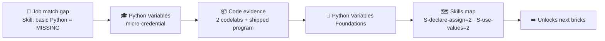
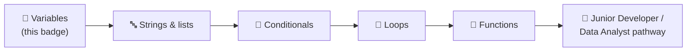

# 🗺️ Skills Map — what the badge unlocks

How the **🏅 Python Variables Foundations** badge writes into a learner's skills map and starts a
developer/data pathway. Conforms to
[`../../specs/skills-map-and-job-matching.md`](../../specs/skills-map-and-job-matching.md).

---

## 🏅 What the badge certifies

On verified completion, the badge sets these components in the learner's skills map:

| Component | Type | Level earned |
| --------- | ---- | ------------ |
| `S-declare-assign` | 🛠️ Skill | **2** |
| `S-use-values` | 🛠️ Skill | **2** |
| `A-attention-detail` | 🌱 Ability | 2 |
| `K-var-concept` | 🧠 Knowledge | 1 |
| `K-data-types` | 🧠 Knowledge | 2 |

```yaml
# fragment merged into the learner's skills map on badge issuance
badge: python-variables-foundations
issued_on: verified-evidence
components:
  S-declare-assign: 2
  S-use-values: 2
  A-attention-detail: 2
  K-var-concept: 1
  K-data-types: 2
```

---

## 🎯 Why this matters for job matching

This is a **foundation** badge: on its own it won't match a full role, but it is the prerequisite
brick under almost every Python-related requirement. It moves a learner from "no evidence" to a
verified first rung.

| Requirement (`must_have`) | Before | After badge |
| ------------------------- | ------ | ----------- |
| Basic Python / scripting (Skill ≥ 1) | ❌ 0 | ✅ 2 |
| Understands data types & conversion (Knowledge ≥ 1) | ❌ 0 | ✅ 2 |
| Writes clean, readable code (Ability ≥ 1) | ⚠️ unproven | ✅ 2 |



---

## 🔗 Where this fits a role pathway

`S-declare-assign` and `S-use-values` are the **first technical bricks** in the foundation layer of
any Python-based role pathway built with
[`../../specs/role-to-credential-mapping.md`](../../specs/role-to-credential-mapping.md). A natural
sequence after this badge:



Pair it with the durable
[Growth Mindset micro-credential](../growth-mindset-micro-credential/README.md) so a learner builds
**both** the hard-skill base *and* the learning attitude that entry-level employers ask for — and
see the [Data Scientist pathway](../role-data-scientist-pathway.md) for how foundation bricks stack
into a full role.

> ⚠️ Per the methodology, AI-suggested matches are **decision support**, not a hiring decision —
> an instructor/employer validates the evidence before the badge counts (human-in-the-loop).
