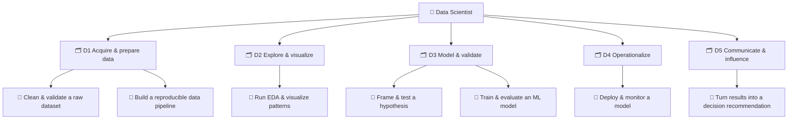
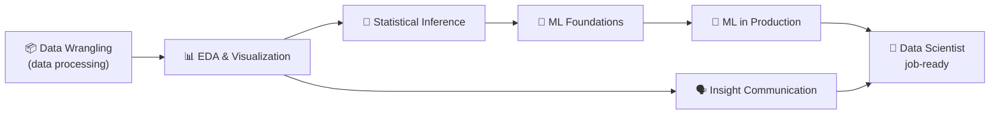

# 📘 Worked Example — *Data Processing → Data Scientist* Pathway

An end-to-end application of the
[Role-to-Credential Mapping methodology](../specs/role-to-credential-mapping.md): we take a
**real role with placement demand** (*Data Scientist*), **deconstruct** it into duties →
tasks → KSA at a **high-performer bar**, **cluster** those into a **pathway of connected
micro-credentials** (starting with *data processing*), and **measure a learner's skills gap**
toward the role.

> Reads alongside: [`ksa-taxonomy.md`](../specs/ksa-taxonomy.md) ·
> [`skills-map-and-job-matching.md`](../specs/skills-map-and-job-matching.md) ·
> [`genai-authoring-workflow.md`](../specs/genai-authoring-workflow.md).

---

## Stage 0 — Target role & demand 🔒

```yaml
role: "Data Scientist"
framework_refs: ["O*NET:15-2051.00", "ESCO:data scientist", "ILO ISCO-08:2511", "SFIA:DATS"]
purpose: "Turn data into validated, decision-ready insight and ML systems."
demand_signals:
  - { signal: "high and growing demand for data/ML roles", value: "high", verified: false }   # NEEDS HUMAN VALIDATION
validated_by: "employer:AcmeData / mentor:@sancarbar"
```

**Why this role:** consistent hiring demand and a clear, *learnable* skill structure that
builds from an accessible entry point — **data processing** — which is itself a job-relevant
competency (data/analytics assistants) and the foundation every downstream duty depends on.

---

## Stages 1–2 — Triangulated duty → task analysis 🔒

Signals used: O\*NET/ESCO task lists (A) + 8 job postings (B) + shadowing & a BEI with 2
senior data scientists (C). Reconciled into duties and observable tasks.



---

## Stages 3–4 — KSA at the high-performer bar

For each task we extract Knowledge / Skill / Ability with a **target level (0–4)** defined as
*"what a strong performer does,"* plus **observable performance criteria** taken from the
observation notes. (Abbreviated to the core components.)

| KSA id | Type | Label | Bar (0–4) | Performance criterion (from observation) | Must-have |
| ------ | ---- | ----- | --------- | ---------------------------------------- | --------- |
| `K-data-types-quality` | 🧠 K | Data types, missingness & quality concepts | 2 | Names failure modes before touching data | yes |
| `S-data-wrangling` | 🛠️ S | Clean/transform data reproducibly | 3 | Justified missing/outlier strategy; rerunnable pipeline | yes |
| `S-pipeline-build` | 🛠️ S | Build a parameterized data pipeline | 2 | Idempotent, documented, version-controlled | yes |
| `K-stats-foundations` | 🧠 K | Probability & inferential statistics | 2 | Chooses the right test; states assumptions | yes |
| `S-eda-visualization` | 🛠️ S | EDA & honest visualization | 3 | Charts answer a question; no misleading scales | yes |
| `S-ml-modeling` | 🛠️ S | Train/evaluate ML models | 3 | Proper train/val/test; metric fits the problem | yes |
| `S-ml-production` | 🛠️ S | Deploy & monitor a model | 2 | Tracks drift; can roll back | no |
| `S-insight-communication` | 🛠️ S | Communicate results to deciders | 3 | Leads with the decision, not the method | yes |
| `A-rigor` | 🌱 A | Analytical rigor / skepticism | 3 | Verifies assumptions; distrusts "too good" results | yes |
| `A-stakeholder-empathy` | 🌱 A | Stakeholder empathy & communication | 2 | Frames work in the audience's terms | yes |
| `A-adaptability` | 🌱 A | Adaptability under changing data/goals | 2 | Re-plans when data invalidates the approach | no |

> Note the **differentiators** the postings didn't list — `A-rigor`, `A-stakeholder-empathy`
> — surfaced by the Behavioral Event Interviews. These often decide who performs well.

---

## Stages 5–6 — Cluster into a sequenced pathway

KSA cluster into six micro-credentials, sequenced by prerequisite and rising proficiency
across the four ADA phases.



| # | Micro-credential | Closes (KSA) | Phase | Capstone (mirrors a real task) |
| - | ---------------- | ------------ | ----- | ------------------------------ |
| 1 | **Data Wrangling** *(data processing)* | `K-data-types-quality`, `S-data-wrangling`, `S-pipeline-build`, `A-rigor` | 1·3 | Ship a reproducible cleaning pipeline + data-quality report on a messy real dataset |
| 2 | **EDA & Visualization** | `S-eda-visualization`, `A-stakeholder-empathy` | 2 | Produce an EDA notebook that answers 3 stakeholder questions honestly |
| 3 | **Statistical Inference** | `K-stats-foundations`, `A-rigor` | 3 | Design + run a valid A/B-style test and defend the assumptions |
| 4 | **ML Foundations** | `S-ml-modeling`, `A-rigor` | 3 | Train, evaluate, and error-analyze a model with leakage-free splits |
| 5 | **ML in Production** | `S-ml-production`, `A-adaptability` | 3 | Deploy a model behind an API with drift monitoring + rollback |
| 6 | **Insight Communication** | `S-insight-communication`, `A-stakeholder-empathy` | 4 | Present a decision recommendation to a non-technical panel |

Each is a standalone **ADA v2 micro-credential** (design them with the
[v2 schema](../specs/micro-credential-v2-schema.md)); **earning all required ones accumulates
into the Data Scientist role profile.**

---

## Stage 8 — Skills-gap analysis for a learner

A learner arrives having done some data work. We evidence their current levels and diff
against the role bar (mechanics: [skills-map spec](../specs/skills-map-and-job-matching.md)).

```yaml
learner: "ada-learner-042"
evidenced:
  - { ref: K-data-types-quality, level: 2, evidence: "quiz:mc-wrangling", verified: true }
  - { ref: S-data-wrangling,     level: 2, evidence: "artifact:cleaning-nb", verified: true }
  - { ref: S-pipeline-build,     level: 1, evidence: "lab:pipeline-1", verified: true }
  - { ref: S-eda-visualization,  level: 1, evidence: "artifact:eda-1", verified: true }
  - { ref: A-rigor,              level: 2, evidence: "360:cohort-3", verified: true }
  # statistics, ML, production, communication, stakeholder-empathy: not yet evidenced (L0)
```

### Resulting skills map (core/must-have rows)

| Component | Type | Bar | Have | Gap | Status |
| --------- | ---- | --- | ---- | --- | ------ |
| K-data-types-quality | 🧠 K | 2 | 2 | 0 | ✅ met |
| S-data-wrangling | 🛠️ S | 3 | 2 | 1 | 🟡 partial |
| S-pipeline-build | 🛠️ S | 2 | 1 | 1 | 🟡 partial |
| K-stats-foundations | 🧠 K | 2 | 0 | 2 | 🔴 missing |
| S-eda-visualization | 🛠️ S | 3 | 1 | 2 | 🟡 partial |
| S-ml-modeling | 🛠️ S | 3 | 0 | 3 | 🔴 missing |
| S-insight-communication | 🛠️ S | 3 | 0 | 3 | 🔴 missing |
| A-rigor | 🌱 A | 3 | 2 | 1 | 🟡 partial |
| A-stakeholder-empathy | 🌱 A | 2 | 0 | 2 | 🔴 missing |

**Ordered plan (prerequisite, then weight):** finish **Data Wrangling** (close
`S-data-wrangling` 2→3, `S-pipeline-build` 1→2) → **EDA & Visualization** → **Statistical
Inference** → **ML Foundations** → **Insight Communication** → **ML in Production**.

The learner is **strongest where they've worked (data processing) and the gap is largest in
modeling, statistics, and communication** — exactly the route the pathway sequences. Re-run
the match after each badge; *job-ready* when every must-have gap is 0 and the match clears the
threshold.

---

## What this demonstrates

- A **real role** becomes a **measurable tree** of duties → tasks → KSA.
- The **bar is set by high performers**, captured through observation, so "passing" means
  "can do the job well," not "saw the material."
- **Connected micro-credentials** form a **pathway**; the first (*data processing*) is both
  immediately useful and the foundation for the rest.
- The learner always has a **number** (the gap / match %) showing exactly what to earn next.

> ⚠️ All KSA levels, demand signals, and mappings above are **illustrative** and must be
> validated by mentors/employers before use — per the methodology's human gates.
