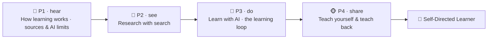

# 🧭 Worked Example — Self-Learning Micro-Credential (full course)

  
  
  
  

A **complete, ready-to-run ADA micro-credential** for the most foundational skill of all: **learning
how to learn** — online, with AI, and on your own. It is a *fully populated* example built end-to-end
with the ADA Methodology (KSA + 4 phases + learning-atom topology): every atom has **real reading
text**, **curated videos**, **Mermaid diagrams**, **image-generation prompts**, hands-on research and
prompting drills, and rubrics.

> 🖥️ **See it live:** open [`course.html`](course.html) in any browser for an interactive, navigable
> version of this course (sidebar, progress, embedded videos, diagrams, copyable prompts).

This is the course that makes every *other* course optional: once you can learn independently, you can
acquire any future skill. It deliberately teaches that **the process of reaching an answer matters
more than the answer**, that **failing is data, not defeat**, how to **research with search engines**
and **learn with AI**, and — importantly — the **limitations of LLMs** so you never trust them blindly.
It complements [Growth Mindset](../growth-mindset-micro-credential/README.md) (the belief that drives
learning) and [Effective Communication](../effective-communication-micro-credential/README.md).

Conforms to [`../../specs/micro-credential-v2-schema.md`](../../specs/micro-credential-v2-schema.md) ·
modalities from [`../../specs/learning-atom-topology.md`](../../specs/learning-atom-topology.md) ·
KSA from [`../../specs/ksa-taxonomy.md`](../../specs/ksa-taxonomy.md).

---

## 🧭 What this teaches

The half-life of any specific skill keeps shrinking; the ability to **teach yourself the next thing**
is what lasts. This course makes self-learning concrete and certifiable: learners build a working
model of how learning actually happens (effort, struggle, and **productive failure** are features,
not bugs), learn to **find trustworthy answers** with search engines, **learn with AI** through basic
prompting while understanding **where LLMs fail**, and run a real **self-directed learning loop** that
they finish by teaching what they learned.

| | |
| --- | --- |
| **Title** | Self-Learning: Learn Anything Online & with AI |
| **Duration** | ~10 hours · 2–3 weeks |
| **Primary KSA** | 🛠️ Skill — *research with search* and *learn with AI*, plus the 🌱 Abilities (curiosity, resilience) that sustain them |
| **Target competency** | O\*NET process skills: **Active Learning** (2.A.2.a), **Learning Strategies** (2.A.2.b), **Critical Thinking** (2.A.2.c) · ESCO transversal *"learn to learn", "manage one's own learning"* · DigComp 1 *Information & data literacy* |
| **Badge** | 🏅 *Self-Directed Learner* |
| **Prerequisites** | None. Internet access and a free AI chat tool (e.g. an LLM assistant) to practice with. |

---

## 📚 Course contents

| # | File | What it is |
| - | ---- | ---------- |
| — | [`micro-credential.md`](micro-credential.md) | The full micro-credential spec (YAML schema, objectives, KSA map, phase planner) |
| 1 | [`atoms/atom-1-how-learning-works.md`](atoms/atom-1-how-learning-works.md) | 🙉 P1 · 🧠 K — How learning works: the process > the answer; learn by failing |
| 2 | [`atoms/atom-2-trust-sources-and-how-ai-works.md`](atoms/atom-2-trust-sources-and-how-ai-works.md) | 🙉 P1 · 🧠 K — Trustworthy sources & how AI really works (LLM limits) |
| 3 | [`atoms/atom-3-research-with-search.md`](atoms/atom-3-research-with-search.md) | 🙈 P2 · 🛠️ S — Research with search engines (Google) & triangulating sources |
| 4 | [`atoms/atom-4-learn-with-ai.md`](atoms/atom-4-learn-with-ai.md) | 🙊 P3 · 🛠️ S — Learn with AI: basic prompts to explain anything + verify |
| 5 | [`atoms/atom-5-self-learning-loop.md`](atoms/atom-5-self-learning-loop.md) | 🙊 P3 · 🛠️ S + 🌱 A — The self-learning loop: learn by failing forward |
| 6 | [`atoms/atom-6-capstone-learn-something-new.md`](atoms/atom-6-capstone-learn-something-new.md) | 🐵 P4 · 🛠️ S + 🌱 A — Capstone: teach yourself something new & teach it back |
| — | [`capstone.md`](capstone.md) | Capstone brief + how it maps to KSA |
| — | [`rubrics.md`](rubrics.md) | All rubrics (knowledge-mini, skill, behavioral, capstone-5) |
| — | [`skills-map.md`](skills-map.md) | Badge → skills map and how it powers every other pathway |

> 🤝 **Practiced for real:** the Abilities (curiosity, resilience-through-failure) are assessed
> **behaviorally across ≥3 occasions** (never a quiz), and the capstone ends in a peer teach-back.

---

## 🔄 Phase journey

---

## 🤖 How it was authored (and how to reuse it)

This course follows the Gen AI authoring workflow in
[`../../specs/genai-authoring-workflow.md`](../../specs/genai-authoring-workflow.md):
competency → KSA → atoms → modalities → rubrics → badge. Conventions used throughout:

- **🎬 Videos** are written as a `youtube` block with the real URL + caption (the interactive site
  embeds them as a click-to-play player).
- **🖼️ Diagrams** are provided two ways: a live **Mermaid** diagram *and* a reusable
  **image-generation prompt** in a `prompt` block.
- **✅ Activities** include search drills, prompt scripts, checklists, and rubrics so the course is
  self-paced and practicable.

> ⚠️ **Human-in-the-loop (methodology guardrail):** the links and references below are **curated
> starting points** — a mentor/instructor should verify each one before delivery. And the whole point
> of Atoms 2 & 4 is that **AI output is never authoritative on its own**: always verify against
> trustworthy sources. See [`../../CLAUDE.md`](../../CLAUDE.md) §5.
