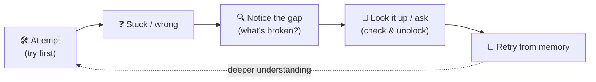
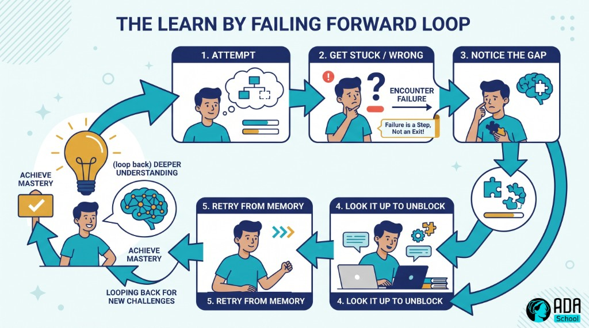

## ⚛ Learning Atom 1 — *How Learning Works (Process > Answer)*

**Phase:** 🙉 1 · Self-Guided Introduction (*hear*) · **KSA:** 🧠 Knowledge · **Target level:** L2
· **Component id:** `K-learning-process`

### 🎯 Learning objective

- **Explain** why the *process* of reaching an answer matters more than the answer itself, and **how
  struggle and failure drive learning.**

### 🧩 Prerequisites

- None. Bring one thing you tried to learn and found hard.

### 🧭 Atom description

Most people think learning means *getting the right answer fast*. That belief quietly sabotages them:
they copy the answer, feel productive, and learn nothing. This atom rewires that. You'll see that the
**effortful process** — struggling, getting it wrong, retrieving from memory — is *where the learning
actually happens*. Get this, and the rest of the course (search, AI, the loop) becomes a way to make
the process better, not a shortcut around it.

---

### 📖 Reading — *The answer is the by-product; the process is the point* (≈ 7 min)

Imagine two students. One watches a worked solution and nods along — it all makes sense. The other
wrestles with the problem, gets stuck, tries three wrong things, then finally cracks it. The first
*feels* like they learned more (it was smooth). The second actually did. This is one of the most
robust findings in the science of learning: **the conditions that make learning feel hard are often
the ones that make it stick.** Researchers call these **desirable difficulties.**

Three ideas to internalize:

- **Process over answer.** The answer is disposable — tomorrow's problem is different. What transfers
  is *how you got there*: the questions you asked, the dead ends you ruled out, the method you built.
  When you copy an answer, you keep the answer and throw away the learning.
- **Productive failure.** Being wrong isn't the opposite of learning — it's part of it. A wrong
  attempt tells you exactly where your model of the world is broken, which is the precise spot to fix.
  Studies on *productive failure* (Kapur) show learners who struggle *before* being shown the solution
  understand it more deeply than those shown first. **Fail → notice the gap → close it.**
- **Metacognition (thinking about your thinking).** Good learners constantly ask: *What do I actually
  understand? Where am I confused? What will I try next?* This self-monitoring is what turns effort
  into progress instead of spinning.

Two traps to avoid:

- **The fluency illusion.** Re-reading and highlighting *feel* like learning but mostly create
  familiarity, not memory. **Retrieval** (closing the book and trying to recall/explain) and **spacing**
  (revisiting over days) are far stronger — even though they feel harder.
- **Answer-seeking.** Jumping straight to "just tell me the answer" (from a person, Google, or an AI)
  skips the struggle that builds understanding. Use answers to **check and unblock**, not to replace
  the attempt. *Try first, then look.*

> **Reframe for the whole course:** when something is hard, you are not failing at learning — you are
> *doing* learning. The discomfort is the sensation of your brain changing.

**Key takeaways**

- [ ] The **process** of reaching an answer is what transfers; the answer is disposable.
- [ ] **Failure is data** — it pinpoints exactly what to fix (*productive failure*).
- [ ] **Retrieval + spacing** beat re-reading, even though they feel harder (*desirable difficulties*).
- [ ] **Metacognition** — ask what you understand and what to try next.
- [ ] **Try first, then look** — use answers to check/unblock, not to skip the struggle.

---

### 🎬 Watch — learning how to learn (pick one, ~10–17 min)

```youtube
https://www.youtube.com/watch?v=O96fE1E-rf8
Barbara Oakley — "Learning how to learn" (TEDxOaklandUniversity).
```

```youtube
https://www.youtube.com/watch?v=5eW6Eagr9XA
Veritasium — "The 4 things it takes to be an expert" (deliberate practice & feedback).
```

---

### 🖼️ See — the learn-by-failing loop





> 🖼️ *Generated image — produced from the prompt below.*

A reusable prompt to generate an on-brand version of this diagram:

```prompt
Create a clean, modern educational infographic of a "learn by failing forward" loop: Attempt → Get
stuck/wrong → Notice the gap → Look it up to unblock → Retry from memory → (loop back) deeper
understanding. Emphasize that failure is a step in the loop, not an exit. Use ADA brand colors (Indigo
#1E2A6E, Turquoise #15B5C6, Gold #E0A53C accents) on a light background, flat vector style, legible
sans-serif, no text errors. 16:9.
```

---

### ✅ Evaluate — Pop quiz (formative, `knowledge-mini`)

1. Why can copying a correct answer leave you having learned almost nothing?
2. What is "productive failure," and why does it help?
3. Name a study habit that *feels* effective but mostly creates an illusion of learning — and what to
   do instead.

<details>
<summary>Answer key</summary>

1. Because the learning is in the **process** of reaching the answer (the questions, dead ends, and
   method) — copying keeps the disposable answer and throws away the transferable process.
2. Struggling/being wrong **before** seeing the solution; it exposes exactly where your understanding
   is broken, so the later explanation lands deeper.
3. **Re-reading/highlighting** (the fluency illusion) → instead use **retrieval practice** (recall
   from memory) and **spacing** (revisit over days).

</details>

---

### 📦 Deliverable

- Pick something you recently "learned" by copying an answer. In 4–6 sentences, describe how you'd
  re-learn it using **try-first + retrieval**, and what gap your earlier shortcut hid.

### 🧠 Final reflection

- When learning feels uncomfortable, what's your usual reaction? How could you reinterpret that
  discomfort after this atom?

### 🔗 Sources to verify (human-in-the-loop)

- Brown, Roediger & McDaniel, *Make It Stick: The Science of Successful Learning*.
- Bjork & Bjork, *Making Things Hard on Yourself, but in a Good Way* (desirable difficulties).
- Kapur, *Productive Failure* (research papers).
- Oakley, *A Mind for Numbers* / "Learning How to Learn" (Coursera).

### 🧩 Connections

- **Successors:** Atom 2 (where to *get* trustworthy answers), Atom 5 (the loop, in practice).
