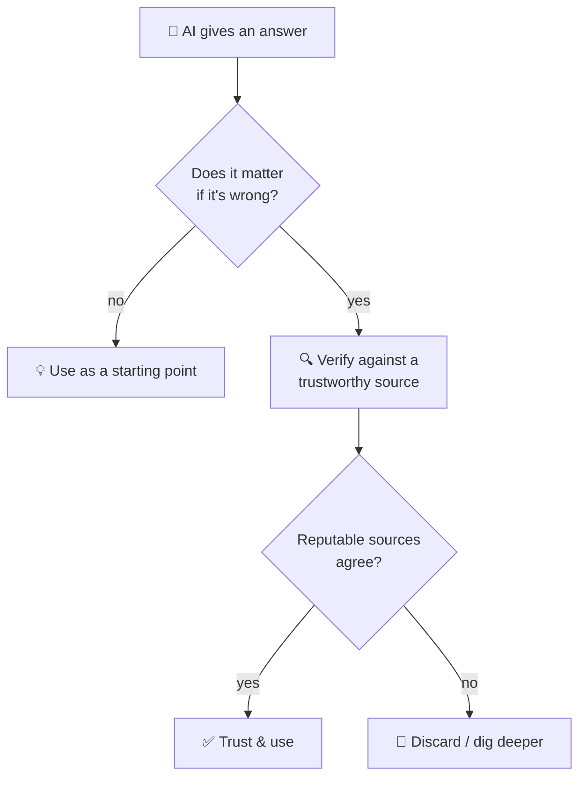

## ⚛ Learning Atom 2 — *Trustworthy Sources & How AI Really Works*

**Phase:** 🙉 1 · Self-Guided Introduction (*hear*) · **KSA:** 🧠 Knowledge · **Target level:** L2
· **Component id:** `K-sources-and-ai-limits`

### 🎯 Learning objective

- **Evaluate** whether a source is trustworthy, and **explain — at a basic level — how LLMs work and
  where they fail.**

### 🧩 Prerequisites

- Atom 1. The mindset of "try first, then verify" carries straight into this atom.

### 🧭 Atom description

Self-learning online means swimming in information of wildly different quality — and now, in
*confident* answers from AI that may simply be wrong. Before you research (Atom 3) or learn with AI
(Atom 4), you need a basic radar for **what to trust** and an honest picture of **what an LLM actually
is.** This is the safety briefing for everything that follows.

---

### 📖 Reading — *Trust, but verify — especially the confident robot* (≈ 8 min)

**Part A — Is this source trustworthy?** A quick checklist (one version is the **CRAAP** test):

- **Currency** — How recent is it? Does recency matter for this topic (it does for tech/medicine,
  less for history)?
- **Relevance** — Does it actually answer *your* question, at the right depth?
- **Authority** — Who wrote it, and what makes them credible? An expert, institution, or peer-reviewed
  outlet beats an anonymous blog or a random forum post.
- **Accuracy** — Is it supported by evidence and consistent with other reputable sources? Can you
  trace its claims?
- **Purpose** — Why does this exist? To inform, to sell, to persuade? Watch for bias and incentives
  (e.g., a "study" funded by the company it flatters).

A **source hierarchy** (rough, not absolute): peer-reviewed research & official documentation > reputable
institutions (universities, established news, standards bodies) > expert practitioners & well-sourced
explainers > anonymous blogs/forums > random social posts. **Triangulate:** trust a claim more when
**two or three independent, reputable sources** agree. Primary sources (the original paper, the
official docs) beat someone's summary of them.

**Part B — How an LLM actually works (basic).** A large language model (the thing behind AI chat) is,
underneath, a very sophisticated **next-word predictor.** It was trained on huge amounts of text and
learned the statistical patterns of language. When you ask it something, it generates the most likely
*sounding* continuation — word by word. It is *not* looking up facts in a database, and it has **no
understanding or intent**; it produces text that *resembles* a correct answer.

That design creates specific, important limitations:

- **Hallucination.** It can state false things — fake facts, fake citations, fake quotes — **fluently
  and confidently.** Plausible ≠ true. This is the single most important thing to remember.
- **Confidence ≠ correctness.** Its certainty in tone tells you *nothing* about whether it's right.
  It will be just as smooth when wrong as when right.
- **Knowledge cutoff / no live data.** A base model only "knows" up to its training date and doesn't
  truly browse the live web (unless a specific tool gives it that, and even then, verify).
- **Bias & gaps.** It reflects biases and blind spots in its training data; it can be confidently
  Western-centric, outdated, or simply ignorant of niche topics.
- **No real sources by default.** If it offers citations, they may be invented. Always check that a
  cited source exists and actually says what's claimed.
- **You steer it.** It often agrees with you (sycophancy) and follows leading questions. Garbage or
  biased prompts in → biased answers out.

> **The golden rule for the rest of this course:** treat an LLM like a **fast, confident, sometimes
> wrong study partner** — brilliant for explaining, brainstorming, and getting unstuck, never the
> final word. **Verify anything that matters against a trustworthy source.**

**Key takeaways**

- [ ] Vet sources with **CRAAP** (Currency, Relevance, Authority, Accuracy, Purpose) and **triangulate.**
- [ ] An LLM is a **next-word predictor** — it has no understanding and isn't a fact database.
- [ ] It can **hallucinate** confidently; **confidence ≠ correctness.**
- [ ] Mind the **knowledge cutoff, bias, and fake citations** — verify against real sources.

---

### 🖼️ See — verify-the-AI flow



A reusable prompt to generate an on-brand version:

```prompt
Create a clean, modern decision-tree infographic titled "Should I Trust This AI Answer?". Branch:
"Does it matter if it's wrong?" → No: "Use as a starting point" / Yes: "Verify against a trustworthy
source" → "Do reputable sources agree?" → Yes: "Trust & use" / No: "Discard or dig deeper". Add a
small caption: "Confidence ≠ correctness." Use ADA brand colors (Indigo #1E2A6E, Turquoise #15B5C6,
Gold #E0A53C), light background, flat vector, legible sans-serif. 16:9.
```

---

### 🧪 Practice — *Source & AI-claim audit*

1. **Source triage.** Take a question you care about and find three sources (e.g., a research/official
   page, a reputable explainer, a random blog/forum). Score each with CRAAP and rank them.
2. **Catch a hallucination.** Ask an AI something specific and checkable (a date, a citation, a niche
   fact). Then verify each claim against a trustworthy source. Note anything that was confidently
   wrong or unverifiable.

<details>
<summary>What good looks like</summary>

- You can articulate *why* one source outranks another (authority + accuracy + purpose).
- You found at least one AI claim you couldn't verify — or proved one wrong — and you didn't take its
  confidence as evidence.

</details>

---

### ✅ Evaluate — Pop quiz (formative, `knowledge-mini`)

1. What does each letter of CRAAP stand for, and what does "triangulate" mean?
2. In one sentence, what is an LLM actually doing when it answers?
3. Why is "the AI sounded very confident" *not* a reason to trust an answer?

<details>
<summary>Answer key</summary>

1. **C**urrency, **R**elevance, **A**uthority, **A**ccuracy, **P**urpose. *Triangulate* = confirm a
   claim across multiple independent, reputable sources.
2. Predicting the **most likely next words** based on patterns in its training data — not looking up
   verified facts.
3. Because LLMs generate confident-sounding text whether right or wrong — **confidence ≠ correctness**,
   and they can **hallucinate.**

</details>

---

### 📦 Deliverable

- Your source-triage ranking (3 sources + CRAAP notes) **and** one documented AI claim you verified or
  debunked, with the trustworthy source you checked against.

### 🧠 Final reflection

- Where have you previously trusted a source (or an AI answer) you shouldn't have? What's your new rule?

### 🔗 Sources to verify (human-in-the-loop)

- CSU/Meriam Library — *The CRAAP Test* (source evaluation).
- DigComp 2.2 — competence area 1: *Information & data literacy*.
- Plain-language explainers on how LLMs work and why they hallucinate (verify currency before use).

### 🧩 Connections

- **Predecessor:** Atom 1. **Successors:** Atom 3 (search for trustworthy sources), Atom 4 (use AI
  safely with verification).
