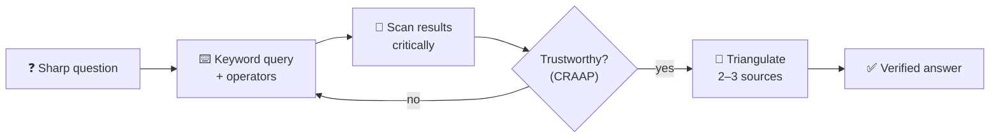

## ⚛ Learning Atom 3 — *Research with Search Engines*

**Phase:** 🙈 2 · Visual Exploration (*see*) · **KSA:** 🛠️ Skill · **Target level:** L2
· **Component id:** `S-search-research`

### 🎯 Learning objective

- **Find and triangulate** trustworthy answers to a real question using a search engine (e.g., Google)
  — crafting good queries, using operators, and reading critically.

### 🧩 Prerequisites

- Atom 2 (source trust) — searching is only useful if you can judge what you find.

### 🧭 Atom description

Search is the most-used learning tool on earth, and almost everyone uses it at 20% of its power. This
atom turns "typing a question and clicking the first link" into a deliberate research skill: ask a
sharp query, use a few operators to cut noise, scan results critically, and triangulate across
sources. It's in Phase 2 (*see*) because you learn it by watching it modeled, then doing a hunt.

---

### 🎬 Watch — searching like a pro (~5–10 min)

```youtube
https://www.youtube.com/watch?v=Fzd07K-bScw
"Google search tips & operators" — a practical explainer (verify before delivery).
```

---

### 📖 Reading — *Ask a better question, get a better answer* (≈ 7 min)

**1) Craft the query.** The search box rewards precision:

- **Use keywords, not full sentences.** Drop filler words; keep the meaningful terms. `python list vs
  tuple difference` beats `what is the difference between a list and a tuple in python please`.
- **Add context that narrows it:** the year, the version, the platform, the domain — `react useEffect
  cleanup 2025`, `excel xlookup vs vlookup`.
- **Speak the source's language.** Think about the words an expert page would use, not how a beginner
  phrases it. Searching the *answer's* vocabulary finds better pages.
- **Iterate.** Your first query is a probe. Read the snippets, steal better terms from them, and
  refine. Research is a loop, not one shot.

**2) Use a few high-leverage operators:**

| Operator | Does | Example |
| -------- | ---- | ------- |
| `"exact phrase"` | Forces an exact match | `"productive failure" learning` |
| `site:` | Search within one site | `site:docs.python.org enumerate` |
| `-word` | Excludes a term | `jaguar speed -car` |
| `filetype:` | Find a file type | `machine learning basics filetype:pdf` |
| `OR` | Either term | `bicycle OR cycling commuting` |
| `intitle:` / `*` | In the title / wildcard | `intitle:tutorial docker` · `"learn * in 30 days"` |

**3) Read the results critically.** Don't auto-click result #1 (it's often an ad or SEO bait). Scan
several snippets, prefer sources that pass the Atom-2 trust test (official docs, reputable
institutions, well-sourced explainers), and **open a few in parallel** to compare. Watch the *date*.

**4) Triangulate & trace.** For anything important, confirm it across **2–3 independent reputable
sources** and try to reach the **primary source** (the original docs/paper), not a copy of a copy. If
sources disagree, that disagreement is itself information — dig into why.

**5) Know when to switch tools.** Search is best for *finding trustworthy sources and current/specific
facts*; AI (Atom 4) is best for *explaining and synthesizing*. Strong self-learners bounce between
them: search to find and verify, AI to understand — then verify the AI with search again.

**Key takeaways**

- [ ] Query with **precise keywords + context**, in the *source's* vocabulary; then **iterate.**
- [ ] A few **operators** (`"..."`, `site:`, `-`, `filetype:`) cut noise fast.
- [ ] **Don't trust result #1 by default** — scan, compare, check dates.
- [ ] **Triangulate** across 2–3 reputable sources and reach the **primary source.**

---

### 🖼️ See — the research loop



A reusable prompt to generate an on-brand version:

```prompt
Create a clean, modern infographic of a "search research loop": Sharp question → Keyword query +
operators → Scan results critically → Trustworthy? (CRAAP) → (loop back if no) → Triangulate 2–3
sources → Verified answer. Use ADA brand colors (Indigo #1E2A6E, Turquoise #15B5C6, Gold #E0A53C),
light background, flat vector, legible sans-serif. 16:9.
```

---

### 🧪 Practice — *Research scavenger hunt* (Challenge / Quest)

Answer each with a search engine, and for each record: your **final query**, the **operator(s)** used,
your **two trustworthy sources**, and the **answer**.

1. Find the **official documentation** page for a tool you use (use `site:`), not a third-party copy.
2. Find a **PDF** report from a reputable institution on a topic you care about (use `filetype:pdf`).
3. Find the **exact origin** of a popular quote — is it correctly attributed? (use `"exact phrase"`).
4. Find the **current** recommended way to do something that changed recently (add a year/version).
5. Find a claim where **two reputable sources disagree** — and note why.

---

### ✅ Evaluate — Performance task (`skill`)

Submit your scavenger-hunt sheet. Scored on:

| Criterion | Excellent (3) | Adequate (2) | Needs work (1) |
| --------- | ------------- | ------------ | -------------- |
| **Query craft** | Precise keywords + apt operators; iterates | Workable queries | Full-sentence, no refinement |
| **Source quality** | Reaches primary/reputable sources | Mostly decent sources | First link / low quality |
| **Triangulation** | Confirms across independent sources | Some cross-checking | Single source |
| **Critical reading** | Notes dates, bias, disagreement | Some critique | Takes results at face value |

> Pass = 2+ each → **L2** evidence for `S-search-research`.

### 📦 Deliverable

- Your completed scavenger-hunt sheet (queries + operators + sources + answers).

### 🧠 Final reflection

- Which operator or habit will most change how you search day-to-day? Why?

### 🔗 Sources to verify (human-in-the-loop)

- Google — *Search operators / refine web searches* (official help).
- DigComp 2.2 — area 1: *browsing, searching and filtering data, information, and digital content*.
- Any reputable "advanced search techniques" guide (verify currency).

### 🧩 Connections

- **Predecessor:** Atom 2. **Successor:** Atom 4 (use AI to *explain* what you find — then verify by
  searching).
