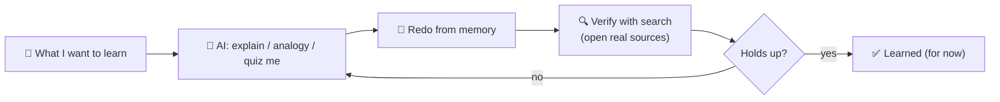

## ⚛ Learning Atom 4 — *Learn with AI (Basic Prompting + Verify)*

**Phase:** 🙊 3 · Applied Practice (*do*) · **KSA:** 🛠️ Skill · **Target level:** L2
· **Component ids:** `S-learn-with-ai`, `K-sources-and-ai-limits`

### 🎯 Learning objective

- **Prompt an AI** to explain a topic at the right level, **ask it for sources**, and **verify** its
  output — using it as a study partner, not an oracle.

### 🧩 Prerequisites

- Atom 2 (how AI works + its limits) and Atom 3 (search, for verification). This atom *applies* both.

### 🧭 Atom description

Used well, an AI assistant is the best on-demand tutor ever made: infinitely patient, available 24/7,
able to re-explain anything five different ways. Used badly, it's a confident misinformation machine
that does your thinking for you. This atom teaches the *well* version: basic prompting to learn, plus
a verification habit that protects you from the limitations you met in Atom 2.

---

### 📖 Reading — *Prompt to learn, not to copy* (≈ 8 min)

**Anatomy of a good learning prompt.** A useful prompt usually has four parts — **Role, Context, Task,
Format**:

- **Role:** *"Act as a patient tutor for a complete beginner."*
- **Context:** what you know and where you're stuck — *"I understand X but not how Y connects."*
- **Task:** what you want — *"Explain Z with a simple analogy, then a concrete example."*
- **Format:** how to deliver — *"Keep it under 150 words; then ask me one question to check I got it."*

**Prompts that make you *learn*, not just receive answers:**

- **Explain at a level:** *"Explain like I'm 12,"* then *"now explain it the way you'd tell a
  professional."* Comparing levels builds real understanding.
- **Analogy + example:** *"Give me an analogy, then a real example, then a counter-example."*
- **Make it quiz you:** *"Ask me 5 questions one at a time to test my understanding, and tell me if
  I'm wrong and why."* This forces **retrieval** (Atom 1) instead of passive reading.
- **Find your gaps:** *"Here's my explanation of X in my own words: [...]. What did I get wrong or
  miss?"* — the single most powerful learning prompt.
- **Unstick, don't solve:** *"Don't give me the answer. Give me a hint and the next question I should
  ask myself."* This protects the productive struggle from Atom 1.
- **Plan a path:** *"I want to learn X in two weeks with ~30 min/day. Give me a step-by-step plan with
  free resources I should verify."*

**The non-negotiable: verify.** Because of hallucination and the other limits from Atom 2:

- **Ask for sources** — *"Cite reputable sources I can check."* — then **actually open them** (they may
  be invented). Reaching the real source is a feature, not a chore.
- **Cross-check anything that matters** with a search (Atom 3), especially facts, numbers, dates, code
  that touches real systems, citations, and anything high-stakes.
- **Don't outsource the struggle.** Use AI to *explain and unblock*, then close the book and **redo it
  yourself from memory.** If you only nodded along, you didn't learn it.
- **Watch sycophancy & leading questions.** If you ask *"isn't X true?"* it may just agree. Ask
  neutrally: *"Is X true? What's the evidence for and against?"*

> **Mental model:** AI is a brilliant, fast, confident **study partner that is sometimes wrong.**
> Pair it with search to verify, and with your own practice to actually learn. Search **finds and
> verifies**; AI **explains and synthesizes**; *you* do the learning.

**Key takeaways**

- [ ] Structure prompts with **Role · Context · Task · Format.**
- [ ] Use prompts that force **retrieval** (quiz me, critique my explanation, hint don't solve).
- [ ] **Always verify** — ask for sources, open them, cross-check with search.
- [ ] **Don't outsource the struggle**; redo it from memory. Ask **neutrally** to avoid sycophancy.

---

### 🖼️ See — search + AI working together



A reusable prompt to generate an on-brand version:

```prompt
Create a clean, modern infographic titled "Learn With AI, Safely": What I want to learn → AI explains
/ quizzes me → Redo from memory → Verify with search (open real sources) → Holds up? → Yes: Learned /
No: back to AI. Caption: "AI explains, search verifies, you learn." Use ADA brand colors (Indigo
#1E2A6E, Turquoise #15B5C6, Gold #E0A53C), light background, flat vector, legible sans-serif. 16:9.
```

---

### 🧪 Practice — *AI study session* (AI Prompt Question + Worksheet)

Pick one real topic you want to understand. Run this sequence with an AI tool and save the transcript:

1. **Explain prompt** (Role·Context·Task·Format) — get a beginner explanation + an example.
2. **Level-shift** — ask for the same idea explained for a professional; note what's added.
3. **Quiz me** — have it ask you 5 questions one at a time; answer from memory.
4. **Critique my understanding** — write your own 4-sentence explanation; ask the AI what you got
   wrong.
5. **Verify** — ask for sources, then **check at least two claims** with a search (Atom 3). Record any
   claim that was wrong, unverifiable, or had a fake citation.

---

### ✅ Evaluate — Performance task (`skill`)

Submit your transcript + worksheet. Scored on:

| Criterion | Excellent (3) | Adequate (2) | Needs work (1) |
| --------- | ------------- | ------------ | -------------- |
| **Prompt quality** | Clear Role·Context·Task·Format; iterates | Workable prompts | Vague one-liners |
| **Learning (not copying)** | Uses quiz/critique/redo-from-memory | Some active use | Passive copy-paste |
| **Verification** | Opens sources; cross-checks; catches an error | Some checking | Takes AI at face value |
| **Judgment about limits** | Articulates where AI helped vs. couldn't be trusted | Some awareness | None |

> Pass = 2+ each → **L2** evidence for `S-learn-with-ai`.

### 📦 Deliverable

- Your AI study-session transcript, your own written explanation, and your verification notes
  (including anything the AI got wrong).

### 🧠 Final reflection

- Where did AI genuinely accelerate your learning, and where did verification save you? What's your
  personal rule for trusting it?

### 🔗 Sources to verify (human-in-the-loop)

- Any reputable, current "prompting basics / how to learn with AI" guide (verify currency).
- Atom 2 of this course (LLM limitations) — re-read before high-stakes use.
- DigComp 2.2 — interacting with and critically evaluating AI-generated content.

### 🧩 Connections

- **Predecessors:** Atoms 2 & 3. **Successor:** Atom 5 (put search + AI inside a full learning loop).
