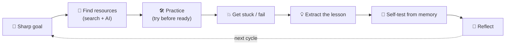

## ⚛ Learning Atom 5 — *The Self-Learning Loop (Learn by Failing Forward)*

**Phase:** 🙊 3 · Applied Practice (*do*) · **KSA:** 🛠️ Skill + 🌱 Ability · **Target level:** L2
· **Component ids:** `S-learning-loop`, `A-curiosity`, `A-resilience-failure`

### 🎯 Learning objective

- **Run a complete self-learning loop** on a small real topic — driven by curiosity and **persisting
  through failure** — and keep a learning log of the process.

### 🧩 Prerequisites

- Atoms 1–4. This atom assembles the whole toolkit into one repeatable process.

### 🧭 Atom description

So far you have the pieces: a mindset (process > answer; failure is data), source judgment, search,
and AI. This atom is where they become a **habit you can point at anything.** You'll pick a genuinely
unknown micro-topic and learn it end-to-end in a single loop — on purpose hitting walls and
documenting how you got past them. This is also where the **Abilities** (curiosity, resilience) get
their first real workout.

---

### 📖 Reading — *One loop you can reuse forever* (≈ 6 min)

The self-learning loop has five steps. The magic is in repeating it in tight cycles, not doing it once
perfectly:

1. **Set a sharp goal.** Make it small and observable. Not "learn data viz" but *"make one bar chart
   from a CSV and explain what it shows."* A goal you can *demonstrate* beats a goal you can only
   *feel.*
2. **Find resources (filter ruthlessly).** Use search (Atom 3) to find 1–2 trustworthy resources and
   AI (Atom 4) to explain the confusing parts. Resist collecting 30 tabs — that's procrastination in
   disguise. Pick a starting point and move.
3. **Practice — try before you're ready.** Attempt the thing *now*, while you still feel unprepared.
   You will get stuck and get things wrong. **Good.** Each failure is a precise pointer to the next
   thing to learn (Atom 1). Look things up to *unblock*, then keep going.
4. **Self-test (retrieve).** Close everything and check: can you do it / explain it from memory? If
   not, you found your gap — loop back to step 2 or 3 for *that specific gap.*
5. **Reflect (metacognition).** Write a few lines: what you learned, what tripped you, what you'd do
   differently. Reflection is what converts a one-off into a transferable method.

**The role of the Abilities in the loop:**

- **🌱 Curiosity** is the engine. It's what makes you ask "but why?" and "what if?", chase the
  interesting tangent, and keep generating questions. Without it, the loop stalls at step 1.
- **🌱 Resilience (learn by failing forward)** is the fuel for steps 3–4. The moment you're stuck is
  the moment most people quit — and it's exactly the moment learning is about to happen. Reframe "I
  failed" as **"I found a gap; that's progress,"** take a breath, and try the next thing. Persistence
  + a new approach, not just grinding the same wrong way.

> **"Failing forward"** means every failure moves you closer because you *extract the lesson* from it.
> A failure you ignore is a loss; a failure you mine is tuition you already paid — collect the lesson.

**Key takeaways**

- [ ] The loop: **goal → resources → practice → self-test → reflect**, repeated in tight cycles.
- [ ] Make goals **small and demonstrable**; avoid resource-hoarding.
- [ ] **Try before you're ready**; treat each stuck moment as the next thing to learn.
- [ ] **Curiosity** drives the loop; **resilience** gets you through the stuck parts.

---

### 🖼️ See — the self-learning loop

---

### 🧪 Practice — *One full loop + learning log* (Project / Quest + Reflection)

Pick a **small, genuinely new** micro-skill you can attempt in ~60–90 minutes (e.g., make a chart from
data, write a one-page summary in a new format, learn 10 phrases of a language and use them, fix a
small thing using docs). Run the loop **and keep a learning log** capturing:

- Your **goal** (small + demonstrable) and **why you're curious** about it.
- The **resources** you chose (and why) — search + AI, with verification.
- **At least two failures / stuck points**, what each one taught you, and how you got past it.
- Your **self-test** result (could you do/explain it from memory?).
- A short **reflection** + what you'd do differently next loop.

**Pair option (collaborate):** swap learning logs with a partner and trade one piece of encouragement
+ one suggestion. Hearing how someone else got unstuck is itself a lesson.

---

### ✅ Evaluate — Behavioral assessment (`behavioral`)

Scored from your learning log + (if paired) your partner's observation. This is a key occasion for the
Abilities:

| Criterion | Excellent (3) | Adequate (2) | Needs work (1) |
| --------- | ------------- | ------------ | -------------- |
| **Loop execution (🛠️)** | All 5 steps, tight cycles, demonstrable goal | Most steps | Skipped practice/self-test |
| **Curiosity (🌱)** | Generates own questions; chases understanding | Some initiative | Waits to be told |
| **Resilience / failing forward (🌱)** | Documents failures + lessons; persists & adapts | Some persistence | Quits or hides the struggle |
| **Verification** | Checks AI/sources within the loop | Some checking | None |
| **Reflection** | Honest, specific, forward-looking | Generic | Missing |

> Pass = 2+ each. This is **occasion 1 of 3** for `A-curiosity` and `A-resilience-failure` (also
> observed in the capstone, and across the course).

### 📦 Deliverable

- Your learning log for one full loop (goal · resources · ≥2 documented failures + lessons · self-test
  · reflection) and the artifact you produced.

### 🧠 Final reflection

- Which step do you skip when you're impatient (usually self-test or reflect)? What does skipping it
  cost you?

### 🔗 Sources to verify (human-in-the-loop)

- Ericsson & Pool, *Peak* (deliberate practice — practice at the edge of ability).
- Zimmerman, *Self-Regulated Learning* (the plan → monitor → reflect cycle).
- Atom 1 of this course (productive failure & retrieval).

### 🧩 Connections

- **Predecessors:** Atoms 1–4. **Successor:** Atom 6 (run the loop on a bigger self-chosen skill and
  teach it back).
