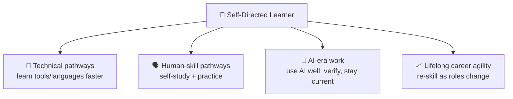

# 🗺️ Skills Map — *Self-Directed Learner*

How earning this badge updates a learner's **skills map** and why it's the highest-leverage credential
in the whole catalog — it makes every *other* credential faster to earn.

> Concept reference: [`../../specs/skills-map-job-matching.md`](../../specs/skills-map-job-matching.md).

---

## 🧩 What the badge writes to the skills map

On issuance, these KSA components are recorded with evidence and level:

| Component | Type | Level | Evidence |
| --------- | ---- | ----- | -------- |
| `K-learning-process` — how learning works | 🧠 Knowledge | L2 | Atom 1 quiz |
| `K-sources-and-ai-limits` — sources & LLM limits | 🧠 Knowledge | L2 | Atom 2 quiz + audit |
| `S-search-research` — research with search | 🛠️ Skill | **L2** | Atom 3 performance task + capstone |
| `S-learn-with-ai` — learn with AI (+ verify) | 🛠️ Skill | **L2** | Atom 4 performance task + capstone |
| `S-learning-loop` — run a self-learning loop | 🛠️ Skill | L2 | Atom 5 log + capstone |
| `A-curiosity` — curiosity & learner agency | 🌱 Ability | L2 | Behavioral, ≥3 occasions |
| `A-resilience-failure` — learn by failing forward | 🌱 Ability | L2 | Behavioral, ≥3 occasions |

---

## 🎯 Why this badge is a force multiplier

Most badges boost one role. **Self-Directed Learner boosts your ability to earn *every other badge***
— and to keep learning after formal training ends. Employers increasingly screen for **learning
agility** and **responsible AI use**; this credential evidences both. It maps to O\*NET process skills
(Active Learning, Learning Strategies, Critical Thinking), ESCO *"learn to learn"*, and DigComp area 1
(information & data literacy), which appear, in some form, in almost every modern role.

---

## 🧭 How it fits a learning pathway

| Stage | Credential | What it adds |
| ----- | ---------- | ------------ |
| **Foundation (do this first)** | 🏅 **Self-Directed Learner** *(this one)* | learn anything online + with AI, safely |
| Pairs with | 🏅 [Growth Mindset](../growth-mindset-micro-credential/skills-map.md) | the belief that effort & failure grow ability |
| Pairs with | 🏅 [Effective Communication](../effective-communication-micro-credential/skills-map.md) | turn what you learn into shared understanding |
| Accelerates | 🐍 [Python Variables](../python-variables-micro-credential/skills-map.md) & all technical badges | self-study makes technical pathways faster |
| Builds toward | *Research Skills · Critical Thinking · AI Literacy* | (future credentials) deeper information work |

> **Job-matching note:** because self-learning is a *transversal, foundational* competency, it rarely
> appears alone in a role's minimums — it **multiplies** the others. The recommended sequence is to
> earn this **first**, then stack role-specific badges on top. Matching against a specific job's
> minimum bar still requires **human (mentor/employer) validation** — AI-suggested mappings are a
> starting point, not a verdict (see [`../../CLAUDE.md`](../../CLAUDE.md) §5).
