# ⚛ Learning Atom Topology

The **complete map of what a Learning Atom can be.** This document expands the ADA Learning
Atom from a handful of formats into a **rich, structured topology of modalities and
sub-types**, with architecture diagrams, selection guidance, and KSA/Phase mappings.

It applies to **both v1 and v2**. In v2, every atom additionally carries a **KSA type**
(🧠 Knowledge · 🛠️ Skill · 🌱 Ability) and a **proficiency target** — see
[`ksa-taxonomy.md`](ksa-taxonomy.md).

> **Diagrams below use [Mermaid](https://mermaid.js.org/).** They render natively on GitHub
> and inside this repo's interactive browser ([`../index.html`](../index.html)).

---

## 1. Where atoms sit in the ADA architecture

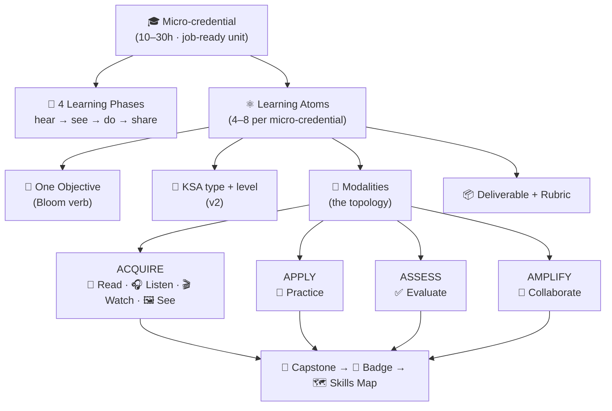

A **Learning Atom** is the smallest instructional unit: **one objective**, taught through a
chosen mix of **modalities**, producing a **deliverable** assessed by a **rubric**.

---

## 2. Anatomy of a Learning Atom (v2)

<p align="center">
  
</p>

A Learning Atom is the **smallest self-contained unit of knowledge** — like a single Lego
brick that provides one specific skill. It layers **Read & Listen** (introduction:
contextualize and feel the *why*) → **Watch & Practice** (application: see the *how*, then
do it) → **Evaluate** (mastery: verify understanding and performance).

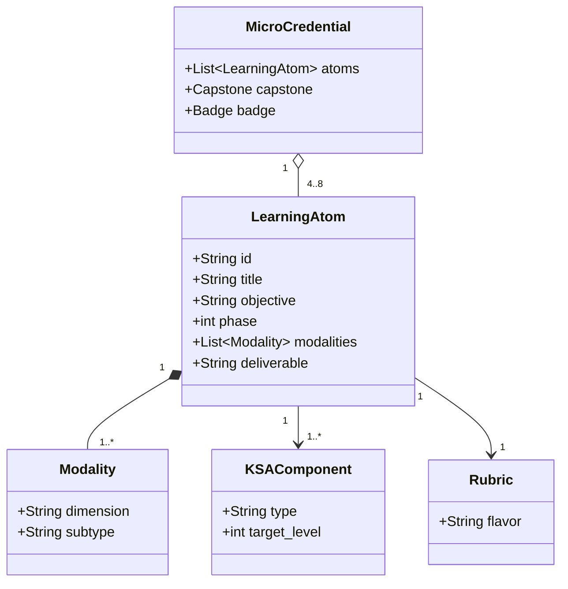

- `dimension` ∈ Read · Listen · Watch · See · Practice · Evaluate · Collaborate
- `subtype` = a leaf from the topology (e.g. *Codelab*, *Podcast*, *Case Study*)
- `type` ∈ knowledge · skill · ability · `target_level` 0–4 · `flavor` ∈ knowledge/skill/ability/capstone

---

## 3. The seven modality dimensions

The ADA atom organizes learning into **7 modalities**, grouped by purpose:

| Group | Modality | Verb | Primary purpose | KSA affinity |
| ----- | -------- | ---- | --------------- | ------------ |
| **Acquire** | 📖 **Read** (Readings) | I read | Acquire concepts via text | 🧠 K |
| **Acquire** | 🎧 **Listen** (Audio) | I hear | Acquire/feel concepts via sound | 🧠 K · 🌱 A |
| **Acquire** | 🎬 **Watch** (Video) | I see | Observe ideas & processes in motion | 🧠 K |
| **Acquire** | 🖼️ **See** (Visual) | I picture | Encode structure & relationships visually | 🧠 K |
| **Apply** | 🧪 **Practice** | I do | Build skill through doing | 🛠️ S |
| **Assess** | ✅ **Evaluate** | I prove | Measure & evidence learning | all |
| **Amplify** | 🤝 **Collaborate** | I share | Learn socially; show dispositions | 🌱 A · 🛠️ S |

> 🖼️ **Visual** is promoted to a first-class modality in this topology (previously folded
> into *Watch*) — diagrams, mental models, and frameworks deserve their own design space.
> 🤖 **AI-assisted** is **cross-cutting**, not a separate dimension: Gen AI can power a
> *Practice* atom (AI Prompt Question), an *Evaluate* atom (AI Q&A check), or a tutor in
> any modality.

---

## 4. The complete topology (mind map)

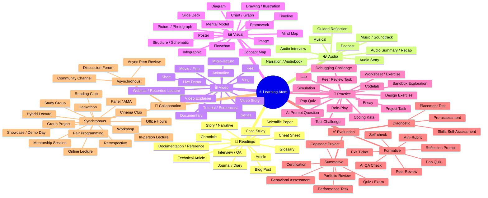

---

## 5. Dimension catalog (sub-types in detail)

KSA key: 🧠 Knowledge · 🛠️ Skill · 🌱 Ability. Phase key: P1 hear · P2 see · P3 do · P4 share.

### 📖 Readings — *acquire concepts through text*

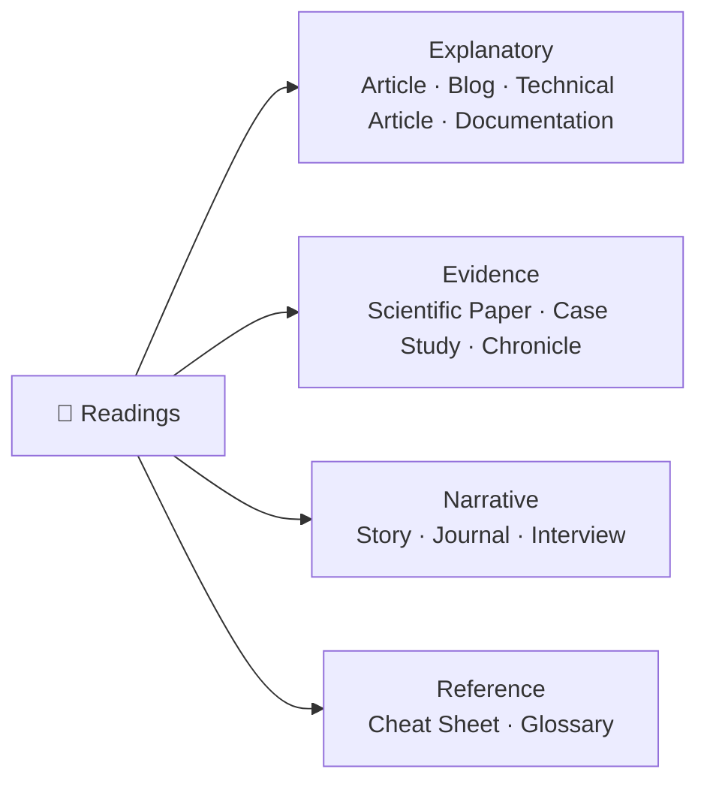

| Sub-type | What it is | Best for | Phase | Example |
| -------- | ---------- | -------- | ----- | ------- |
| Article | General explanatory text | 🧠 | P1 | "What is a REST API?" |
| Blog Post | Practitioner, informal POV | 🧠 | P1 | "5 mistakes in API design" |
| Story / Narrative | Concept via storytelling | 🧠🌱 | P1 | A startup's scaling story |
| Chronicle | Chronological account / history | 🧠 | P1 | "History of the Web" |
| Technical Article | Deep how/why with rigor | 🧠🛠️ | P1·P3 | "HTTP caching internals" |
| Scientific Paper | Peer-reviewed research | 🧠 | P1 | Diffusion models paper |
| Case Study | Real applied scenario analysis | 🧠🛠️ | P2 | "How Acme cut latency 40%" |
| Journal / Diary | Reflective first-person log | 🌱 | P4 | Learner's growth journal |
| Documentation / Reference | Authoritative spec/API docs | 🧠🛠️ | P3 | Flask docs |
| Cheat Sheet | Condensed quick reference | 🧠 | P3 | HTTP status code card |
| Glossary | Term definitions | 🧠 | P1 | KSA glossary |
| Interview / Q&A | Expert insights in text | 🧠🌱 | P1 | Q&A with a senior dev |

### 🎧 Audio — *acquire and feel concepts through sound*

| Sub-type | What it is | Best for | Phase | Example |
| -------- | ---------- | -------- | ----- | ------- |
| Podcast | Conversational deep-dive | 🧠🌱 | P1 | Episode on API security |
| Narration / Audiobook | Narrated reading of a text | 🧠 | P1 | Narrated chapter |
| Audio Story | Dramatized narrative | 🧠🌱 | P1 | Story of a famous outage |
| Musical | Concept through song + lyrics | 🧠🌱 | P1 | A "states of HTTP" song |
| Music / Soundtrack | Focus / emotional framing | 🌱 | any | Deep-work focus track |
| Audio Interview | Recorded expert conversation | 🧠 | P1 | Interview with an SRE |
| Audio Summary / Recap | Short spoken recap | 🧠 | P1·P4 | 3-min module recap |
| Guided Reflection | Prompted introspection | 🌱 | P4 | Guided retro audio |

### 🎬 Video — *observe ideas and processes in motion*

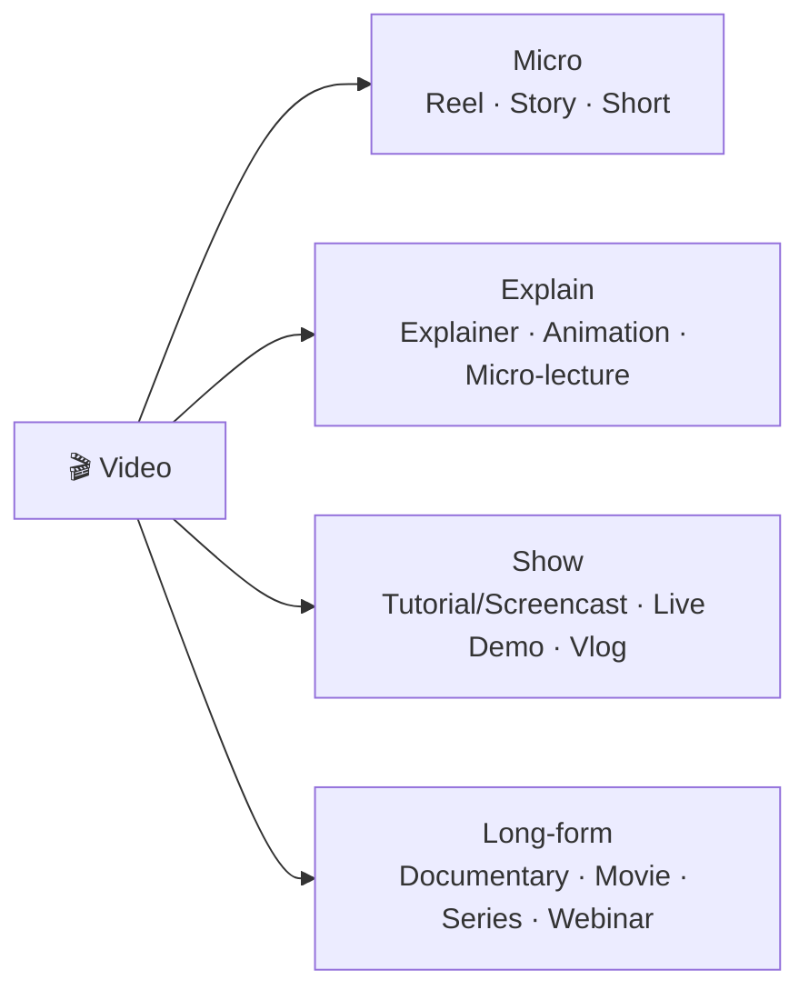

| Sub-type | What it is | Best for | Phase | Example |
| -------- | ---------- | -------- | ----- | ------- |
| Reel | Ultra-short hook (<60s) | 🧠 | P1 | "REST in 45 seconds" |
| Video Story | Ephemeral short narrative | 🧠 | P1 | Behind-the-scenes clip |
| Short | Short-form (1–3 min) | 🧠 | P1 | "What is idempotency?" |
| Video Explainer | Explanatory, often animated | 🧠 | P1 | Animated REST explainer |
| Tutorial / Screencast | Step-by-step on-screen demo | 🛠️ | P2·P3 | "Build an endpoint" cast |
| Live Demo | Live demonstration | 🛠️ | P2 | Mentor codes live |
| Animation | Motion-graphic concept | 🧠 | P1 | How packets travel |
| Documentary | Long-form factual | 🧠🌱 | P1 | "The story of the internet" |
| Movie / Film | Narrative film | 🧠🌱 | P1 | A film on ethics in tech |
| Series | Episodic course video | 🧠 | across | A multi-part React series |
| Webinar / Recorded Lecture | Talk recording | 🧠 | P1 | Recorded conference talk |
| Micro-lecture | Focused short lecture | 🧠 | P1 | 6-min concept lecture |
| Vlog | Practitioner video log | 🌱 | P1 | "A day as a backend dev" |

### 🖼️ Visual — *encode structure and relationships*

| Sub-type | What it is | Best for | Phase | Example |
| -------- | ---------- | -------- | ----- | ------- |
| Image | Single illustrative image | 🧠 | P2 | Request/response graphic |
| Picture / Photograph | Real photo as evidence | 🧠 | P2 | Photo of a server rack |
| Diagram | Labeled relationships | 🧠 | P2 | Client–server diagram |
| Drawing / Illustration | Created illustration | 🧠 | P2 | Sketch of the OSI layers |
| Structure / Schematic | Architectural/structural view | 🧠🛠️ | P2 | System architecture |
| Mental Model | A way of thinking, visualized | 🧠🌱 | P2 | "The pit of success" |
| Framework | Structured model | 🧠 | P2 | The KSA framework |
| Infographic | Data + visual narrative | 🧠 | P1·P2 | "State of APIs 2026" |
| Mind Map | Branching concept map | 🧠 | P2 | This topology |
| Concept Map | Nodes + relations | 🧠 | P2 | Concept web of REST |
| Chart / Graph | Quantitative visualization | 🧠🛠️ | P2 | Latency over time |
| Timeline | Temporal sequence | 🧠 | P2 | Evolution of HTTP |
| Flowchart | Process flow | 🧠🛠️ | P2 | Request lifecycle |
| Slide Deck | Structured visual presentation | 🧠 | P1·P2 | Intro slides |
| Poster | Summary visual | 🧠 | P4 | Capstone poster |

### 🧪 Practice — *build skill through doing*

| Sub-type | What it is | Best for | Phase | Example |
| -------- | ---------- | -------- | ----- | ------- |
| Lab | Hands-on guided exercise | 🛠️ | P3 | Build a CRUD endpoint |
| Codelab | Step-by-step coding walkthrough | 🛠️ | P3 | Flask codelab |
| Essay | Written argument / synthesis | 🧠🌱 | P3·P4 | "When to use REST vs GraphQL" |
| Test Challenge | Applied problem to solve | 🛠️ | P3 | Fix the failing API |
| Pop Quiz | Quick low-stakes retrieval | 🧠 | P1·P3 | 5-question check |
| AI Prompt Question | Craft/critique prompts w/ Gen AI | 🛠️ | P3 | Prompt an AI to scaffold tests |
| Simulation | Realistic scenario practice | 🛠️🌱 | P3 | Incident-response sim |
| Role-Play | Interpersonal scenario | 🌱🛠️ | P3 | Stakeholder negotiation |
| Coding Kata | Repeatable deliberate practice | 🛠️ | P3 | FizzBuzz / refactor kata |
| Project Task | Build a real deliverable | 🛠️ | P3 | Ship a feature |
| Worksheet / Exercise | Structured drills | 🧠🛠️ | P3 | SQL exercises |
| Sandbox Exploration | Open experimentation | 🛠️🌱 | P3 | Play in a REPL |
| Debugging Challenge | Fix a broken artifact | 🛠️ | P3 | Debug a 500 error |
| Design Exercise | Create a design artifact | 🛠️ | P3 | Design an API schema |
| Peer Review Task | Critique others' work | 🛠️🌱 | P4 | Review a PR |

### ✅ Evaluation — *measure and evidence learning*

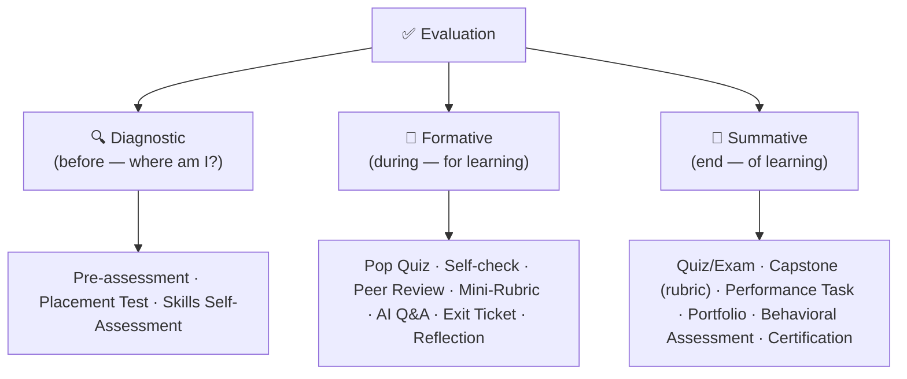

| Bucket | Sub-type | Purpose | KSA fit |
| ------ | -------- | ------- | ------- |
| 🔍 Diagnostic | Pre-assessment | Baseline before learning | all |
| 🔍 Diagnostic | Placement Test | Route learner to right level | all |
| 🔍 Diagnostic | Skills Self-Assessment | Seed the learner KSA profile | all |
| 🔁 Formative | Pop Quiz | Quick retrieval check | 🧠 |
| 🔁 Formative | Self-check | Learner-driven check | 🧠🛠️ |
| 🔁 Formative | Peer Review | Feedback during work | 🛠️🌱 |
| 🔁 Formative | Mini-Rubric | 3-criteria fast scoring | 🛠️ |
| 🔁 Formative | AI Q&A Check | AI probes understanding | 🧠 |
| 🔁 Formative | Exit Ticket / Reflection | Capture takeaways | 🌱 |
| 🏁 Summative | Quiz / Exam | Final knowledge measure | 🧠 |
| 🏁 Summative | **Capstone Project (rubric)** | Integrative job task (5-criteria) | all |
| 🏁 Summative | Performance Task | Demonstrate a skill | 🛠️ |
| 🏁 Summative | Portfolio Review | Body of evidence | all |
| 🏁 Summative | Behavioral Assessment | Ability across ≥3 occasions | 🌱 |
| 🏁 Summative | Certification | Verified, badged outcome | all |

> The **Capstone Project** is **summative** and graded with the 5-criteria rubric;
> **rubrics themselves** are tools used in both formative (mini-rubric) and summative
> (capstone) evaluation.

### 🤝 Human Collaboration — *learn socially, show dispositions*

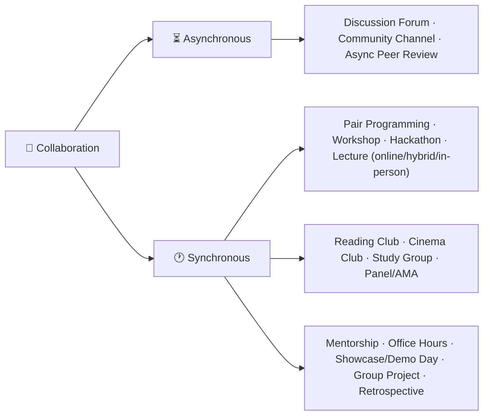

| Sub-type | Mode | What it is | Best for | Phase |
| -------- | ---- | ---------- | -------- | ----- |
| Discussion Forum | async | Threaded discussion | 🌱🧠 | P4 |
| Community Channel | async | Ongoing chat (Slack/Discord) | 🌱 | all |
| Async Peer Review | async | Review submitted work | 🛠️🌱 | P4 |
| Pair Programming | sync | Two people, one task | 🛠️🌱 | P3·P4 |
| Reading Club | sync | Group discussion of a text | 🧠🌱 | P4 |
| Cinema Club | sync | Group film + discussion | 🧠🌱 | P4 |
| Online Lecture | sync | Live remote teaching | 🧠 | P1·P2 |
| Hybrid Lecture | sync | Mixed remote + in-person | 🧠 | P1·P2 |
| In-person Lecture | sync | Physical classroom | 🧠 | P1·P2 |
| Workshop | sync | Hands-on facilitated session | 🛠️ | P3 |
| Hackathon | sync | Intensive build event | 🛠️🌱 | P3·P4 |
| Mentorship Session | sync | 1:1 coaching | 🌱🛠️ | all |
| Office Hours | sync | Open Q&A with expert | 🧠🛠️ | all |
| Study Group | sync | Peer learning circle | 🧠🌱 | all |
| Showcase / Demo Day | sync | Present finished work | 🌱 | P4 |
| Panel / AMA | sync | Expert panel / ask-me-anything | 🧠🌱 | P1 |
| Group Project | sync | Team deliverable | 🛠️🌱 | P3·P4 |
| Retrospective | sync | Reflect on process | 🌱 | P4 |

---

## 6. Modality ↔ KSA mapping

Different modalities develop different KSA types. Choose modalities that match the atom's
KSA target.

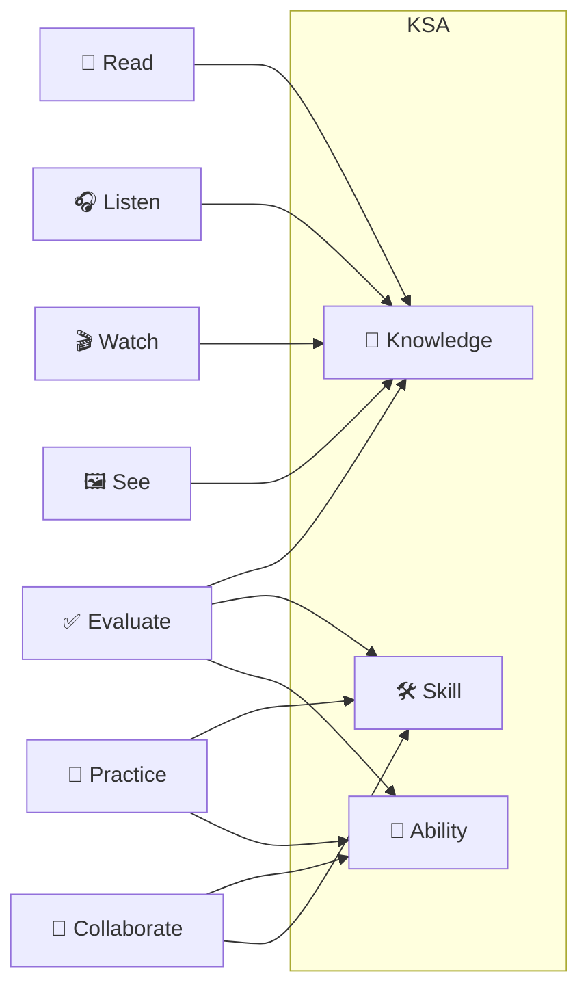

| KSA target | Lead modalities | Evidence / Evaluation |
| ---------- | --------------- | --------------------- |
| 🧠 Knowledge | Read · Listen · Watch · See + retrieval Practice | Pop Quiz, Quiz, AI Q&A |
| 🛠️ Skill | Watch (demo) → Practice (lab/codelab) | Performance Task, Mini-Rubric, Peer Review |
| 🌱 Ability | See (model it) + Practice (role-play) + Collaborate | Behavioral Assessment (≥3), Reflection, 360 |

---

## 7. Modality ↔ Phase mapping

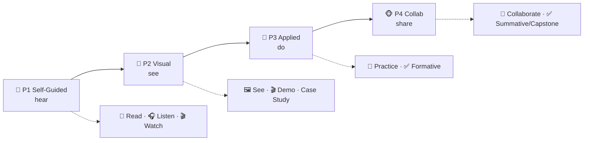

| Phase | Dominant modalities | Typical sub-types |
| ----- | ------------------- | ----------------- |
| 🙉 P1 hear | Read, Listen, Watch | Article, Podcast, Explainer, Reel |
| 🙈 P2 see | See, Watch | Diagram, Mental Model, Screencast, Case Study |
| 🙊 P3 do | Practice, Evaluate (formative) | Codelab, Lab, Pop Quiz, Simulation |
| 🐵 P4 share | Collaborate, Evaluate (summative) | Pair Programming, Showcase, Capstone |

---

## 8. How to choose the right format (decision flow)

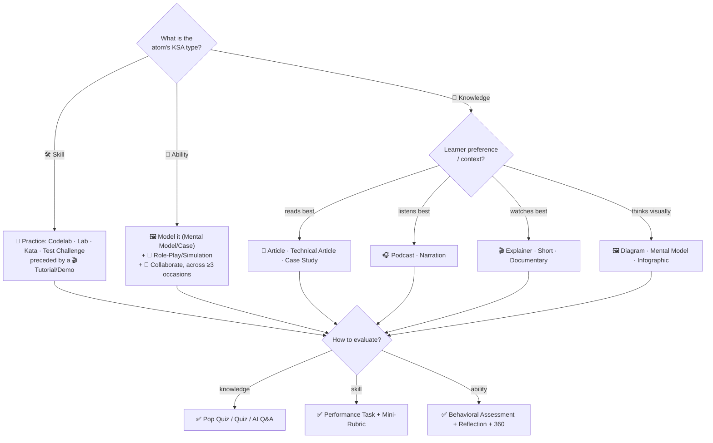

**Rules of thumb**
- Pair **at least one Acquire** modality with **one Apply** modality per skill atom.
- Offer **modality choice** for Knowledge atoms (read *or* listen *or* watch) for accessibility.
- Never assess an **Ability** with a quiz — use behavioral evidence across occasions.
- Use **Visual** to compress complex structure (architecture, process, model) before practice.

---

## 9. The atom learning flow

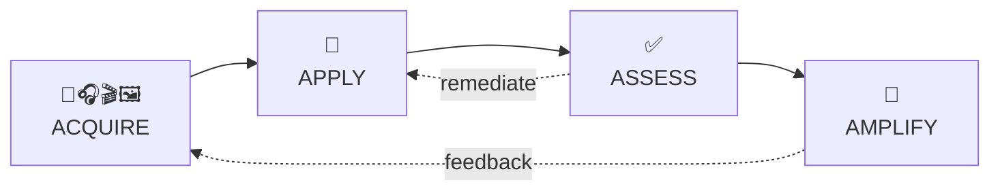

Atoms are **adaptive**: weak assessment loops back to more practice; collaboration feeds
reflection back into acquisition.

---

## 10. Composing atoms into a micro-credential

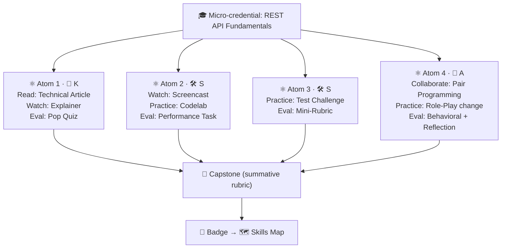

---

## 11. Generating atoms by type with Gen AI

The [Gen AI authoring workflow](genai-authoring-workflow.md) selects modalities from this
topology based on the atom's KSA type:

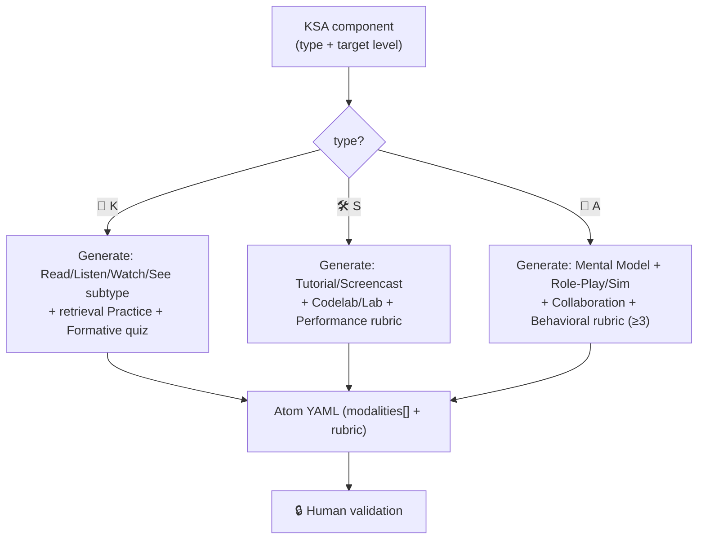

**Prompt add-on (use with Stage 4 of the workflow):**

```
When designing the atom, pick concrete modality sub-types from the Learning Atom Topology
that match the KSA type. Output a modalities[] list, each {dimension, subtype}. For
knowledge offer 2+ Acquire options (read/listen/watch/see) for accessibility; for skill
include a Practice subtype + a Tutorial/Demo; for ability include a Visual model, a
Practice role-play/simulation, and a Collaboration subtype assessed across ≥3 occasions.
```

---

## 12. Authoring checklist (topology-aware)

- [ ] Atom has **one objective** (Bloom verb) and a **KSA type + level** (v2).
- [ ] Modalities are chosen **from this topology** and **match the KSA type**.
- [ ] Knowledge atoms offer **≥2 Acquire options** for accessibility.
- [ ] Skill atoms pair an **Acquire/Demo** with a **Practice** sub-type.
- [ ] Ability atoms use **See + Practice + Collaborate** and a **behavioral** evaluation.
- [ ] Evaluation sub-type matches purpose (**diagnostic / formative / summative**).
- [ ] At least one **collaboration** sub-type appears in the micro-credential (P4).
- [ ] Sub-types are realistic and use **free/accessible** tools where possible.

---

## Cross-references

- ⚛ [Learning Atom Template](../templates/learning-atom-template.md) — pick modalities here.
- 🧬 [ADA v2 KSA Framework](ada-v2-ksa-framework.md) · [KSA Taxonomy](ksa-taxonomy.md)
- 🗺️ [Skills Map & Job Matching](skills-map-and-job-matching.md)
- 🤖 [Gen AI Authoring Workflow](genai-authoring-workflow.md)
- 📘 Examples: [Technical](../examples/ksa-technical-skill-rest-api.md) ·
  [Human](../examples/ksa-human-skill-feedback.md) ·
  [Attitude](../examples/ksa-attitude-adaptability.md)
