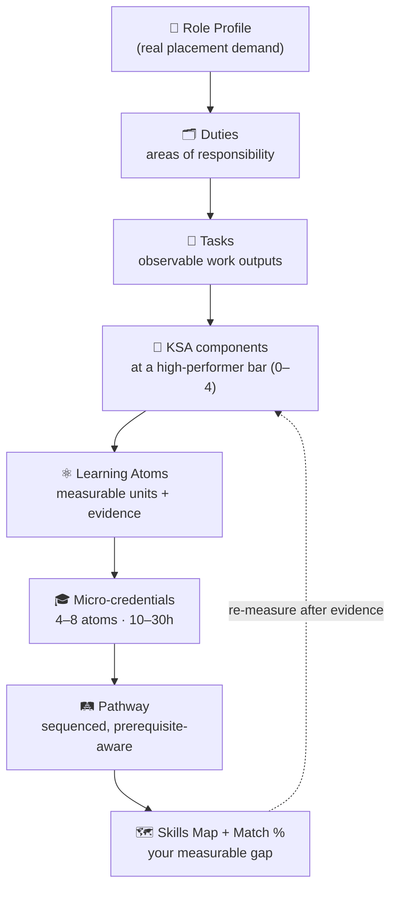
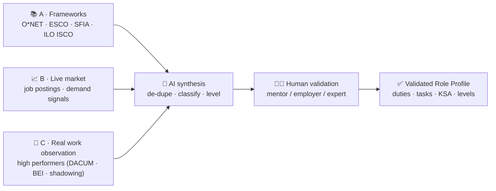
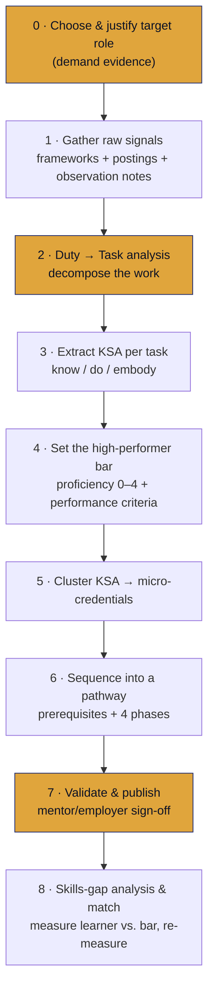

# 🧭 Role-to-Credential Mapping — From Job Profiles to Measurable Learning

This spec defines the **methodology and practices** for turning a **real job/role profile**
(e.g. *Data Scientist*) into a **connected pathway of micro-credentials** and **measurable
learning units**, so a learner can close a **skills gap** and **match the bar set by high
performers** in that role.

It is the **bridge between the labor market and the ADA building blocks**. Where
[`ksa-taxonomy.md`](ksa-taxonomy.md) defines *what kinds* of competencies exist and
[`skills-map-and-job-matching.md`](skills-map-and-job-matching.md) defines *how gaps are
scored*, this spec defines **how you discover, in the first place, the competencies a role
truly requires** — by triangulating frameworks, live demand, and **observation of how
experts actually do the work** — and how you **deconstruct** that into credentials.

> **The dynamic learning system, in one line:** pick a role with real placement demand →
> deconstruct it into duties → tasks → KSA at a high-performer bar → cluster into
> micro-credentials → sequence into a pathway → measure the gap → learn and re-measure
> until *job-ready*.

---

## 1. Core idea: a role is a learnable structure

A job is not a monolith. Decomposed, it is a **measurable tree**:

```
ROLE  ─ is performed through ─►  DUTIES (areas of responsibility)
DUTY  ─ is carried out as ────►  TASKS (observable work outputs)
TASK  ─ requires ────────────►  KSA components (Knowledge · Skills · Abilities)
KSA   ─ is developed by ──────►  LEARNING ATOMS (Read·Listen·Watch·See·Practice·Evaluate·Collaborate)
ATOMS ─ cluster into ────────►  MICRO-CREDENTIALS (10–30h, job-ready units)
MC    ─ sequence into ───────►  a PATHWAY (the route to the role)
PATHWAY ─ measured against you ►  SKILLS MAP + JOB-MATCH %  (the gap)
```



Every arrow is a design decision you can make **explicit, measurable, and validated by a
human expert** — which is what makes the learning system *dynamic* (re-run it as demand,
tools, or the learner change).

---

## 2. Triangulate three sources of truth

No single source captures a real role. Postings under-state durable competencies; frameworks
lag the market; a single expert is idiosyncratic. **Triangulate, then let AI synthesize and
a human validate.**



| Source | Gives you | Strength | Watch-out |
| ------ | --------- | -------- | --------- |
| **A. Frameworks** (O\*NET, ESCO, SFIA, ILO ISCO-08) | Canonical duties, tasks, and a stable competency vocabulary | Authoritative, comparable, citable | Generic; lags new tools/roles |
| **B. Live market** (job postings, demand data) | What employers *ask for now*; placement demand | Current, role-specific | Over-indexes on tools/keywords; under-states Abilities |
| **C. Real work observation** (high performers) | What experts *actually do*, and the **differentiators** between average and top performers | Reveals tacit skills + attitudes | Effort; small-sample bias; needs consent |

> **Why observe high performers?** Job-readiness isn't "can do the task at all" — it's "can
> do it like someone who is *good* at the job." Observation surfaces the **competency
> differentiators** (often Abilities/attitudes: judgment, rigor, communication, ownership)
> that postings rarely name but that decide real performance.

---

## 3. The deconstruction pipeline (with human gates)

A repeatable, AI-assisted process. Stages 0, 2, and 7 are **human gates** — AI proposes, a
mentor/employer validates.



### Stage 0 — Choose & justify the target role 🔒
- Name the role and anchor it to a framework id (e.g. **O\*NET 15-2051.00 Data Scientists**,
  **ESCO** "data scientist", **ILO ISCO-08 2511**).
- Capture a **demand signal** (openings, growth, local placement data) so the pathway targets
  a role that actually hires. Record the source.
- **Gate:** program owner confirms the role is worth building for.

### Stage 1 — Gather raw signals
- Pull the framework duty/task lists. Collect **5–15 real job postings**. Schedule
  **observation** of 2–4 high performers (see §4). Store everything as evidence.

### Stage 2 — Duty → Task analysis 🔒
- Decompose the role into **4–8 duties**, each into **observable tasks** (a task produces a
  work output you could point at). Use AI to draft from the signals; **validate with an
  expert panel (DACUM)**.

### Stage 3 — Extract KSA per task
- For each task ask: what must one **Know** (K), **be able to do** (S), and **consistently
  embody** (A) to perform it *well*? Tag each with a stable id (`K-`/`S-`/`A-`) and a
  `framework_ref`. Mark inferences `NEEDS HUMAN VALIDATION`.

### Stage 4 — Set the high-performer bar
- For each KSA, set a **target proficiency 0–4** (see [`ksa-taxonomy.md` §4](ksa-taxonomy.md))
  defined as *"what a high performer does."* Write **observable performance criteria** drawn
  from the observation notes — these become the **measurable** anchor for assessment.

### Stage 5 — Cluster KSA into micro-credentials
- Group related KSA (shared task, shared prerequisites) into **micro-credentials** (10–30h,
  4–8 atoms, ≥1 Skill and ≥1 Ability each). Each micro-credential = a coherent, badge-worthy
  slice of the role.

### Stage 6 — Sequence into a pathway
- Order micro-credentials by **prerequisite** and increasing proficiency, mapped across the
  **4 ADA phases** (hear → see → do → share). Output a pathway graph.

### Stage 7 — Validate & publish 🔒
- Mentor/employer reviews the duties, KSA, levels, and pathway. Fix gaps (especially missing
  Abilities). Only then publish.

### Stage 8 — Skills-gap analysis & match
- Compare a learner's evidenced profile to the role's bar → **skills map + match %**
  (mechanics in [`skills-map-and-job-matching.md`](skills-map-and-job-matching.md)). Learn,
  produce evidence, re-measure. This loop is what makes it *dynamic*.

---

## 4. Practices for observing high performers

The differentiating step. Use one or more of these established job-analysis practices, scaled
to your time budget.

### 4.1 DACUM (Developing A Curriculum) panel
A facilitated half-day workshop with **5–8 expert workers** who chart the role's **duties and
tasks** on the spot. Fast, high-validity source for Stage 2. Capture the chart verbatim.

### 4.2 Work shadowing / job shadowing
Observe an expert doing real work. Use a structured log:

- [ ] **Trigger** — what starts this task? (ticket, data drop, meeting)
- [ ] **Steps** — the actual sequence, tools, and decisions taken
- [ ] **Inputs/Outputs** — what they consume and produce (artifacts)
- [ ] **Decision points** — where judgment is applied; what options they weighed
- [ ] **Quality bar** — how they know the output is "good"
- [ ] **Differentiators** — what they do that a novice wouldn't

### 4.3 Behavioral Event / Critical Incident Interview (BEI / CIT)
Ask the expert to narrate **specific recent incidents** ("tell me about the last time a model
underperformed in production"): *situation → task → action → result → what made the
difference*. CIT/BEI is the classic technique for surfacing the **Abilities** (judgment,
rigor, communication) that separate top performers.

### 4.4 Artifact & telemetry analysis
Collect what top performers **produce** (notebooks, dashboards, PRs, reports, docs) and, where
available, work telemetry. Reverse-engineer the implied KSA and quality criteria.

### 4.5 Ethics & rigor
- **Consent & privacy:** observe with permission; anonymize incidents; never capture personal/
  confidential data.
- **Avoid single-expert overfit:** triangulate ≥2 performers + framework + postings.
- **Separate *what* from *who*:** describe behaviors, not personalities.

---

## 5. Making learning units *measurable*

A learning unit is "measurable" when its success is defined by **observable performance at a
stated level**, drawn from real work. Convert each KSA into a measurable unit:

| From observation… | …to a measurable learning unit |
| ----------------- | ------------------------------ |
| What a high performer **does** | A KSA component with a **target level (0–4)** |
| **How** you know their output is good | **Performance criteria** (the rubric anchors) |
| The **artifact** they produce | The atom's **deliverable / evidence type** |
| A real recurring **task** | The micro-credential's **capstone** (mirror a real duty) |
| The **differentiators** | The **Ability** criteria + reflection prompts |

**The measurability rules:**
1. **Every KSA carries a level and observable criteria** — no "understand X"; instead
   "explains X and predicts the failure mode (L2)."
2. **Evidence matches type** — Knowledge → quiz/explanation; Skill → artifact/performance
   rubric; Ability → behavioral rubric across ≥3 occasions + reflection.
3. **The capstone is a real duty** — the final assessment reproduces an actual work task at
   the high-performer bar, so "passing" means "can do the job."
4. **The gap is a number** — distance between the learner's evidenced level and the bar feeds
   the match score; learning is "done" when the gap closes, not when time is served.

> Skills gap (per component) = `max(0, target_level − evidenced_level)`. The pathway exists to
> drive every must-have gap to zero. See the scoring model in
> [`skills-map-and-job-matching.md`](skills-map-and-job-matching.md).

---

## 6. AI prompts for role deconstruction

Reusable prompts that plug into the [Gen AI Authoring Workflow](genai-authoring-workflow.md).
All assume the Stage-0 system grounding from that spec and obey: **triangulate, cite or flag,
propose-don't-assert.**

### 6.1 Role demand & framing (Stage 0)
```
Target role: "<role title>".
1) Map it to the closest O*NET, ESCO, SFIA, and ILO ISCO-08 codes (cite ids).
2) Summarize its core purpose in one sentence.
3) List signals of labor-market demand you can find or that I should verify
   (openings, growth, typical employers), marking anything unverified
   "NEEDS HUMAN VALIDATION".
Output YAML: { role, framework_refs[], purpose, demand_signals[] }.
```

### 6.2 Duty → Task decomposition (Stage 2)
```
Using (A) the framework duty/task lists, (B) these job postings, and (C) these
observation/DACUM notes, produce the role's work structure.
- 4–8 DUTIES (areas of responsibility).
- Under each, the observable TASKS (each produces a nameable work output).
- For each task note its trigger, output artifact, and the source(s) it came from
  (framework | posting | observation).
Reconcile overlaps; flag tasks seen in observation but absent from frameworks as
"emergent". Output YAML per the Role Profile schema (§7).

FRAMEWORKS: """<paste>"""   POSTINGS: """<paste>"""   OBSERVATIONS: """<paste>"""
```

### 6.3 KSA extraction at the high-performer bar (Stages 3–4)
```
For each task below, extract the KSA needed to perform it LIKE A HIGH PERFORMER.
- Knowledge (K-), Skill (S-), Ability (A-) with stable ids, labels, framework_ref.
- target_level 0–4 (ADA scale) = the level a strong performer shows.
- performance_criteria: 2–4 OBSERVABLE statements (from the observation notes) that
  describe success at that level.
- weight 1–5 and must_have true/false.
Add Abilities implied by the observed "differentiators" even if postings omit them, marked
inferred:true. Output YAML: tasks[] -> ksa[].

TASKS: """<paste from 6.2>"""   OBSERVATION DIFFERENTIATORS: """<paste>"""
```

### 6.4 Cluster into micro-credentials (Stage 5)
```
Cluster these KSA components into ADA micro-credentials (10–30h, 4–8 atoms, each covering
≥1 Skill and ≥1 Ability). For each: title, the KSA ids it closes, target role link, a
capstone that mirrors one real task, and Bloom-aligned objectives tagged with KSA id+level.
Output YAML per micro-credential-v2-schema. Keep clusters prerequisite-coherent.
```

### 6.5 Sequence the pathway (Stage 6)
```
Order these micro-credentials into a learning PATHWAY toward "<role>".
Respect prerequisites; rise in proficiency; map each to the ADA phase it emphasizes
(hear→see→do→share). Output YAML: pathway{ role, steps[]{ mc_id, requires[], phase } } and a
Mermaid flowchart LR of the sequence.
```

### 6.6 Gap calibration (Stage 8)
```
Given this role's KSA bar and a learner's evidenced profile, produce the skills map, the
match %, blockers, and the ordered to_earn plan (per skills-map-and-job-matching spec).
Express each gap as max(0, target_level − evidenced_level). Output the minimal JSON + table.
```

---

## 7. Schemas

### 7.1 Role Profile (work structure)
```yaml
role: "Data Scientist"
framework_refs: ["O*NET:15-2051.00", "ESCO:data scientist", "ILO ISCO-08:2511", "SFIA:DATS"]
purpose: "Turn data into validated, decision-ready insight and ML systems."
demand_signals:
  - { signal: "openings (local market)", value: "high", source: "<link>", verified: false }
validated_by: "employer:AcmeData / mentor:@sancarbar"     # human gate
duties:
  - id: D-data-prep
    label: "Acquire & prepare data"
    tasks:
      - id: T-clean-dataset
        label: "Clean & validate a raw dataset for analysis"
        trigger: "new raw data drop"
        output_artifact: "reproducible cleaning notebook + data quality report"
        sources: [framework, posting, observation]
        ksa:
          - { ref: S-data-wrangling, type: skill, target_level: 3, weight: 5, must_have: true,
              performance_criteria: ["handles missing/outliers with justified strategy",
                                     "pipeline is reproducible and documented"] }
          - { ref: A-rigor, type: ability, target_level: 3, weight: 4, must_have: true, inferred: true,
              performance_criteria: ["verifies assumptions before trusting results"] }
```

### 7.2 Pathway (sequence of micro-credentials)
```yaml
pathway:
  role: "Data Scientist"
  readiness_threshold: 85
  steps:
    - { mc_id: mc-data-wrangling,        requires: [],                       phase: 1 }
    - { mc_id: mc-eda-visualization,     requires: [mc-data-wrangling],      phase: 2 }
    - { mc_id: mc-statistical-inference, requires: [mc-eda-visualization],   phase: 3 }
    - { mc_id: mc-ml-foundations,        requires: [mc-statistical-inference],phase: 3 }
    - { mc_id: mc-ml-in-production,      requires: [mc-ml-foundations],      phase: 3 }
    - { mc_id: mc-insight-communication, requires: [mc-eda-visualization],   phase: 4 }
```

These reuse the KSA ids and feed directly into the
[skills-map](skills-map-and-job-matching.md) and
[micro-credential v2 schema](micro-credential-v2-schema.md).

---

## 8. Worked example — *Data Processing → Data Scientist*

A full, end-to-end application of this pipeline (role demand → duties/tasks → KSA at the
high-performer bar → micro-credential pathway → skills map → match) is in:

> 📘 [**`../examples/role-data-scientist-pathway.md`**](../examples/role-data-scientist-pathway.md)

It shows how mastering **data processing** is the first credential on a sequenced route that
accumulates into the **Data Scientist** role profile, and how a learner's gap is measured at
each step.

---

## 9. Conformance checklist for a role deconstruction

- [ ] Target role anchored to ≥1 framework id **and** a real demand signal.
- [ ] Evidence **triangulated** (framework + ≥5 postings + ≥2 high-performer observations).
- [ ] Role decomposed into duties → observable tasks (each with an output artifact).
- [ ] Every task mapped to KSA with **types, levels, and observable performance criteria**.
- [ ] Proficiency bar = **high-performer** behavior, not "can do at all".
- [ ] Abilities/differentiators captured (not just tools) and **employer-validated**.
- [ ] KSA clustered into micro-credentials (each ≥1 Skill + ≥1 Ability) and **sequenced** into
      a prerequisite-aware pathway across the 4 phases.
- [ ] Each micro-credential's capstone mirrors a **real task** at the role bar.
- [ ] Gap is computable and the match loop re-measures after each evidence event.
- [ ] Human sign-off recorded at Stages 0, 2, and 7.

---

## 10. Guardrails

- **Human-in-the-loop is mandatory.** AI deconstructs; mentors/employers/expert workers
  validate duties, KSA, levels, and the pathway before publication or badging.
- **Don't ship tool lists as competencies.** A keyword ("Pandas") is a Skill *with* a
  Knowledge prerequisite and usually an Ability layer (rigor, judgment) — model all three.
- **Surface the hidden Abilities.** Postings omit durable competencies; observation reveals
  them. A role map with **0 Abilities** is incomplete.
- **Avoid single-source/single-expert bias.** Triangulate and observe more than one performer.
- **Privacy & consent** for all observation; anonymize incidents.
- **Keep it accessible & current.** Prefer free/open tools; re-run the pipeline as demand and
  tooling evolve — the system is meant to be dynamic.

---

> License: CC BY-SA 4.0 · Maintained by [Ada School](https://ada-school.org/).
