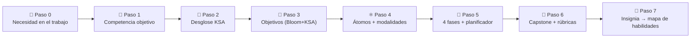

# 🚀 Plantilla de Micro-Credencial ADA

Usa esta plantilla para diseñar un **Micro Curso (micro-credencial ADA)** que desarrolle
**cualquier habilidad que tu organización necesite que alguien realice** — una tarea laboral real,
hecha a un estándar real. Cada sección tiene **\[instrucciones entre corchetes]**; reemplázalas con
tu contenido. Ejemplo completo:
[micro-credencial de Mentalidad de Crecimiento](../../examples/growth-mindset-micro-credential/README.md) *(contenido en inglés)*.

---

## 🧭 Cómo usar esta plantilla — *de una necesidad de habilidad a un curso en 7 pasos*



1. **Paso 0 — Nombra la necesidad** (abajo): ¿qué debe *hacer* alguien en el trabajo y cómo se ve "lo bueno"?
2. **Paso 1 — Anclala** a una competencia reconocida (SFIA · O\*NET · ESCO · ILO).
3. **Paso 2 — Desglósala en KSA** — 🧠 Conocimiento, 🛠️ Habilidad, 🌱 Aptitud — para enseñar/evaluar cada parte correctamente.
4. **Paso 3 — Escribe objetivos Bloom**, cada uno etiquetado con su tipo KSA.
5. **Paso 4 — Diseña 4–8 átomos de aprendizaje**, eligiendo modalidades de la topología.
6. **Paso 5 / 6 — Secuencia las 4 fases**, luego agrega capstone + rúbricas.
7. **Paso 7 — Emite una insignia** que escriba niveles KSA en un mapa de habilidades para emparejamiento laboral.

> 🔗 Método detallado para Paso 0–2: [Mapeo de Rol a Credencial](../../specs/role-to-credential-mapping.md)
> · Tipos y niveles KSA: [Taxonomía KSA](../../specs/ksa-taxonomy.md)
> · menú de modalidades: [Topología del Átomo de Aprendizaje](../../specs/learning-atom-topology.md).

---

## 🏢 Paso 0 — Necesidad de Habilidad Organizacional *(intake)*

Empieza aquí. Describe la **tarea real** que necesitas que alguien realice — no un tema. Si puedes
observar a una persona de alto desempeño haciéndolo, mejor aún (ver DACUM / shadowing en el spec de mapeo de rol).

| Pregunta de intake | Tu respuesta |
| ------------------ | ------------ |
| **¿Qué debe ser capaz de *hacer* la persona?** (una tarea observable) | \[ej. "Facilitar un retro de incidentes sin culpas que produzca acciones correctivas"] |
| **¿Quién lo realiza / en qué rol(es)?** | \[rol, equipo, seniority] |
| **Por qué importa** (resultado de negocio / costo de la brecha) | \[impacto si se hace bien vs. mal] |
| **Cómo se ve "lo bueno"** (comportamiento de alto desempeño, el estándar) | \[1–3 señales observables de maestría] |
| **Referencia a marco reconocido** | \[competencia SFIA · O\*NET · ESCO · ILO] |
| **Brecha actual** (dónde están hoy los estudiantes) | \[lo que aún no pueden hacer / hacen de forma inconsistente] |
| **Evidencia de maestría** (cómo sabrás que pueden hacerlo) | \[el artefacto/comportamiento que lo demuestra] |

> ⚠️ Los mapeos de habilidades asistidos por IA son **apoyo a la decisión** — pide a un mentor o
> al responsable de contratación que valide la tarea, el estándar y la evidencia antes de construir (humano en el ciclo).

---

## 🎓 Título de la Micro-Credencial

\[Escribe un título claro y alineado con competencias.]
**Ejemplo:** *Resiliencia Empresarial: Estrategias para Adaptarse y Prosperar*

---

## ⏳ Duración Estimada

\[Define la duración: horas o semanas. Las micro-credenciales ADA suelen ser de 10–30 horas.]
**Ejemplo:** *15 horas · 3 semanas (5h/semana)*

---

## 🎯 Competencia Laboral Objetivo

\[Identifica la habilidad laboral del mundo real que desarrolla el curso, referenciando marcos como SFIA, O\*NET, o ESCO.]
**Ejemplo:** *Capacidad de diseñar e implementar estrategias de continuidad y resiliencia empresarial.*

---

## 🧬 Paso 2 — Desglose KSA

Divide la competencia en componentes tipificados. El **tipo decide cómo lo enseñas y evalúas**:
Conocimiento → adquirir + quiz; Habilidad → practicar + rúbrica de desempeño; Aptitud → práctica
auténtica repetida + rúbrica conductual a lo largo de varias ocasiones. Define un nivel objetivo
**0–4** (ver [Taxonomía KSA](../../specs/ksa-taxonomy.md)).

| Tipo KSA | Componente (qué sabe / puede hacer) | Por qué este tipo | Nivel objetivo |
| -------- | ----------------------------------- | ----------------- | -------------- |
| 🧠 Conocimiento | \[concepto / hecho a comprender] | base habilitante | \[0–4] |
| 🛠️ Habilidad | \[un procedimiento concreto y practicable] | el *saber-hacer* | \[0–4] |
| 🌱 Aptitud | \[una disposición / actitud duradera] | probada por el comportamiento en el tiempo | \[0–4] |

> Una "habilidad que alguien debe realizar" casi siempre necesita **las tres**: algo de
> Conocimiento, la Habilidad central, y las Aptitudes (juicio, adaptabilidad, colaboración) que la consolidan.

---

## 🔑 Prerrequisitos

\[Lista el conocimiento, habilidades o herramientas que los estudiantes ya deben tener. Si no hay ninguno, escribe "Ninguno."]

* [ ] \[Habilidad o conocimiento #1]
* [ ] \[Habilidad o conocimiento #2]

---

## 📘 Objetivos de Aprendizaje

\[Define 3–5 objetivos usando **verbos de la taxonomía de Bloom**. Etiqueta cada uno con su
**tipo KSA** (🧠 C / 🛠️ H / 🌱 A) para que la modalidad y la rúbrica correctas sean obvias. Cada uno será apoyado por Átomos de Aprendizaje.]

**Ejemplo (etiquetado):**

* 🧠 **Comprender** modelos de resiliencia organizacional.
* 🛠️ **Diseñar** una estrategia de resiliencia para un escenario de crisis.
* 🌱 **Adaptar** decisiones con calma a medida que cambian las condiciones (demostrado en varias ocasiones).

**Ejemplo:**

* **Comprender** modelos de resiliencia organizacional.
* **Analizar** vulnerabilidades en entornos cambiantes.
* **Diseñar** estrategias de resiliencia para respuesta a crisis.
* **Evaluar** enfoques de liderazgo en contextos inciertos.

---

## 💡 Habilidades a Desarrollar (Competencias Laborales)

\[Lista 1–3 habilidades específicas y medibles que los estudiantes podrán demostrar.]

**Ejemplo:**

* Diagnosticar niveles de resiliencia organizacional.
* Aplicar toma de decisiones adaptativa en contextos inciertos.
* Crear un marco de resiliencia para gestión de crisis.
* Fomentar culturas organizacionales colaborativas y resilientes.

---

## ⚛ Átomos de Aprendizaje

Cada **Átomo de Aprendizaje** = *Concepto + Ejemplo + Práctica + Evaluación*
\[Diseña 4–8 átomos, uno por objetivo de aprendizaje. Completa los detalles usando la tabla de abajo.]
Construye cada átomo desde la [Plantilla de Átomo de Aprendizaje](plantilla-atomo-aprendizaje.md)
y elige **modalidades** de la [Topología del Átomo de Aprendizaje](../../specs/learning-atom-topology.md)
que se ajusten al tipo KSA del átomo:

- 🧠 **Conocimiento** → 📖 Leer · 🎧 Escuchar · 🎬 Ver (video) · 🖼️ Visualizar
- 🛠️ **Habilidad** → 🧪 Practicar (Lab · Codelab · Simulación) + rúbrica de desempeño
- 🌱 **Aptitud** → 🖼️ Modelar · 🧪 Practicar · 🤝 Colaborar, en varias ocasiones

| Átomo  | Objetivo        | KSA | Modalidades (sub-tipos)              | Práctica                 | Evaluar                              |
| ------ | --------------- | --- | ----------------------------------- | ------------------------ | ------------------------------------ |
| Átomo 1| \[Objetivo #1]  | \[🧠/🛠️/🌱] | \[ej. Artículo · Explainer · Diagrama] | \[Mini-laboratorio o ejercicio] | \[Quiz, reflexión, mini-rúbrica] |
| Átomo 2| \[Objetivo #2]  | …   | …                                   | …                        | …                                    |

---

## 🔍 Fases de Aprendizaje ADA

Cada fase usa **Átomos de Aprendizaje** y sigue la progresión de Confucio: 

*oír → ver → hacer → compartir*.

---

### 🙉 Fase 1: Introducción Autoguiada

> *"Lo oigo y lo olvido."  — Confucio*

**Objetivo:** Introducir conceptos a través del autoaprendizaje.
Incluye: 📖 lecturas · 🎥 videos · 🎧 podcasts · 📚 casos de estudio · ❓ cuestionarios

---

### 🙈 Fase 2: Exploración Visual

> *"Lo veo y lo recuerdo."  — Confucio*

**Objetivo:** Reforzar el aprendizaje visual y experimentalmente.
Incluye: 🧩 demostraciones · 🎞️ recorridos · 🧪 juego de roles · 📊 exploración de escenarios

---

### 🙊 Fase 3: Práctica Aplicada

> *"Lo hago y lo entiendo."  — Confucio*

**Objetivo:** Aplicar conocimiento en desafíos prácticos.
Incluye: 🧪 laboratorios prácticos · 💻 tareas de código · 🛠️ simulaciones · 📝 evaluación basada en rúbricas

---

### 🐵 Fase 4: Colaboración y Reflexión

> *"Lo comparto y lo multiplico."  — Metodología ADA*

**Objetivo:** Promover aprendizaje colaborativo y reflexión.
Incluye: 👥 retroalimentación entre pares · 🗣️ proyectos de co-creación · 🌐 foros · 🎤 presentaciones de exhibición.

---

## 📋 Planificador de Contenido por Fases (Tabla Editable)

\[Usa esta tabla para **listar el contenido, actividades y evaluaciones** para cada fase. Reemplaza los marcadores de posición con los detalles de tu curso.]

| Fase                                 | Átomo(s) de Aprendizaje | Contenido y Recursos                        | Actividad/Práctica                         | Método de Evaluación                  |
| ------------------------------------ | ----------------------- | ------------------------------------------- | ------------------------------------------ | ------------------------------------- |
| Fase 1: Introducción Autoguiada     | \[Átomo #1, Átomo #2]  | \[Artículos, videos, podcasts]             | \[Pregunta de reflexión, quiz corto]       | \[Quiz, verificación P&R con IA]     |
| Fase 2: Exploración Visual          | \[Átomo #2, Átomo #3]  | \[Animaciones, demos, escenario de juego de roles] | \[Recorrido guiado, discusión grupal] | \[Retroalimentación formativa]       |
| Fase 3: Práctica Aplicada           | \[Átomo #3, Átomo #4]  | \[Manual de laboratorio, herramientas, datasets] | \[Laboratorio práctico, desafío de código] | \[Mini-rúbrica + retroalimentación] |
| Fase 4: Colaboración y Reflexión    | \[Átomo #4]            | \[Brief de proyecto, foro entre pares]     | \[Presentación capstone, revisión entre pares] | \[Rúbrica capstone + retroalimentación entre pares] |

---

## 🚀 Proyecto Capstone

\[Diseña un **proyecto listo para portafolio** que integre todas las habilidades del curso. Debe simular una tarea laboral real y ser evaluado con la rúbrica de abajo.]

**Ejemplo:**
*Los estudiantes crearán un **Plan de Resiliencia Empresarial** para una empresa, incluyendo:*

1. **Relevancia** → Alineación con necesidades de continuidad empresarial.
2. **Aplicación de Habilidades** → Uso de marcos de resiliencia.
3. **Resolución de Problemas y Creatividad** → Enfoques innovadores a crisis.
4. **Claridad y Comunicación** → Entregable claro y profesional.
5. **Colaboración y Reflexión** → Retroalimentación entre pares y reflexión documentada.

---

## 📊 Evaluación y Valoración

* ✅ Cuestionarios y preguntas de reflexión por átomo (formativa)
* ✅ Retroalimentación en laboratorios y mini-proyectos (mini-rúbrica)
* ✅ Proyecto capstone calificado con rúbrica (sumativa)
* ✅ Revisión entre pares y/o mentor (opcional)

---

### 🔹 Mini-Rúbrica para Laboratorios/Átomos (3 Criterios)

| Criterio        | Excelente (3)                                | Adecuado (2)                      | Necesita Mejorar (1)           |
| --------------- | -------------------------------------------- | --------------------------------- | ------------------------------ |
| **Precisión**   | Tarea completada correctamente sin errores mayores | Mayormente correcto, errores menores | Incorrecto o incompleto     |
| **Aplicación**  | Demuestra uso correcto del concepto/herramienta | Aplicación parcial, algunas brechas | Aplicación débil o faltante |
| **Claridad**    | Entrega clara y bien organizada              | Cierta claridad, necesita mejoras | Poco claro o difícil de seguir |

> \[Usar para laboratorios pequeños, ejercicios de código o tareas de práctica. Escala rápida de 3 puntos para velocidad.]

---

### ✨ Rúbrica Estándar para Proyecto Capstone (5 Criterios)

| Criterio                                 | Excelente (5)                               | Bueno (3–4)                     | Necesita Mejorar (1–2)          | Peso |
| ---------------------------------------- | ------------------------------------------- | ------------------------------- | ------------------------------- | ---- |
| **Relevancia (Alineación con Competencia Laboral)** | Completamente alineado con la competencia laboral objetivo | Mayormente alineado, brechas menores | Alineación débil o faltante | 20% |
| **Aplicación de Habilidades**            | Uso avanzado y correcto de herramientas/métodos | Uso adecuado, errores menores | Aplicación mínima o incorrecta | 25% |
| **Resolución de Problemas y Creatividad** | Soluciones innovadoras y prácticas         | Adecuado pero convencional      | Originalidad limitada, impráctico | 20% |
| **Claridad y Comunicación**              | Claro, bien estructurado, profesional      | Generalmente claro, algunos problemas | Poco claro, mal estructurado | 15% |
| **Colaboración y Reflexión**             | Fuerte compromiso entre pares + reflexión  | Compromiso moderado             | Mínimo o faltante              | 20% |

---

### 📝 Plantilla de Rúbrica en Blanco (Capstone – Completar)

| Criterio                                 | Excelente (5) \[Describir dominio] | Bueno (3–4) \[Describir desempeño adecuado] | Necesita Mejorar (1–2) \[Describir desempeño débil] | Peso \[%] |
| ---------------------------------------- | ---------------------------------- | -------------------------------------------- | ---------------------------------------------------- | --------- |
| **Relevancia (Alineación con Competencia Laboral)** | \[Describir]                  | \[Describir]                                 | \[Describir]                                         | \[20%]    |
| **Aplicación de Habilidades**            | \[Describir]                      | \[Describir]                                 | \[Describir]                                         | \[25%]    |
| **Resolución de Problemas y Creatividad** | \[Describir]                     | \[Describir]                                 | \[Describir]                                         | \[20%]    |
| **Claridad y Comunicación**              | \[Describir]                      | \[Describir]                                 | \[Describir]                                         | \[15%]    |
| **Colaboración y Reflexión**             | \[Describir]                      | \[Describir]                                 | \[Describir]                                         | \[20%]    |

---

## 📦 Recursos de Apoyo

\[Lista cualquier dataset, herramientas, código inicial, plantillas o guías que los estudiantes necesitarán.]

* 📁 \[Datasets, APIs o casos de estudio]
* 🧰 \[Notebooks iniciales o plantillas]
* 🧭 \[Instrucciones de configuración o guías de herramientas]

---

## 🏅 Paso 7 — Insignia → Mapa de Habilidades *(emparejamiento laboral)*

Define la insignia para que al completarla se **escriban niveles KSA comprobados en el mapa de
habilidades del estudiante**, que luego puede compararse contra el mínimo requerido por cualquier
empleo (ver [Mapa de Habilidades y Emparejamiento Laboral](../../specs/skills-map-and-job-matching.md)).

```yaml
badge:
  name: "[Nombre de la insignia — ej. Practicante de Resiliencia]"
  evidence_required: ["[atomo-x]", "[atomo-y]", "capstone"]   # qué debe verificarse
  issued_on: verified-evidence                                # firma de mentor/empleador
  components:                                                 # niveles KSA que certifica
    K-[id]: [0-4]
    S-[id]: [0-4]
    A-[id]: [0-4]
```

| El empleo pide… (imprescindible) | Esta insignia comprueba | Match |
| -------------------------------- | ----------------------- | ----- |
| \[habilidad / aptitud + nivel mín.] | \[componente → nivel logrado] | ✅ / ⚠️ / ❌ |

---

## 🎓 Resultados y Reconocimiento

\[Define lo que los estudiantes obtienen al final.]

* Dominio conceptual de \[dominio/habilidad].
* Aplicación práctica y lista para el trabajo de la **habilidad que tu organización necesita**.
* Proyecto de portafolio para exhibir.
* **Insignia digital** compatible con LinkedIn que actualiza el mapa de habilidades del estudiante.

---

## ✅ Checklist de Conformidad de Diseño

Antes de publicar, confirma que el Micro Curso esté **listo para el trabajo y alineado al método**:

* [ ] El Paso 0 nombra una **tarea real que alguien debe realizar**, con un "cómo se ve lo bueno" observable.
* [ ] La competencia está anclada a **SFIA / O\*NET / ESCO / ILO**.
* [ ] Cada objetivo es **verbo de Bloom + tipo KSA** (🧠/🛠️/🌱).
* [ ] **4–8 átomos**, cada uno con modalidades elegidas según su tipo KSA.
* [ ] Las aptitudes/actitudes se evalúan con una **rúbrica conductual en varias ocasiones** (nunca un solo quiz).
* [ ] Hay un **capstone** que simula la tarea real + una rúbrica de 5 criterios.
* [ ] La **insignia** mapea a niveles KSA y alimenta un **mapa de habilidades** para emparejamiento laboral.
* [ ] Un **mentor/empleador** validó la necesidad de habilidad y la evidencia (humano en el ciclo).
* [ ] Los recursos son actuales, accesibles y con licencia adecuada.

---

## 👥 Créditos y Contribuyentes

\[Agrega el/los autor(es), mentores u organización que creó la micro-credencial.]