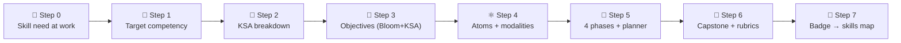

# 🚀 ADA Micro-Credential Template

Use this template to design a **Micro Course (ADA micro-credential)** that develops **any skill
your organization needs someone to actually perform** — a real job task, done to a real standard.
Each section has **\[instructions in brackets]**; replace them with your content. Worked example:
[Growth Mindset micro-credential](../examples/growth-mindset-micro-credential/README.md).

---

## 🧭 How to use this template — *from a skill need to a course in 7 steps*



1. **Step 0 — Name the skill need** (below): what must someone *do* at work, and what does "good" look like?
2. **Step 1 — Anchor it** to a recognized competency (SFIA · O\*NET · ESCO · ILO).
3. **Step 2 — Break it into KSA** — 🧠 Knowledge, 🛠️ Skill, 🌱 Ability — so each piece is taught/assessed correctly.
4. **Step 3 — Write Bloom objectives**, each tagged with its KSA type.
5. **Step 4 — Design 4–8 learning atoms**, choosing modalities from the topology.
6. **Step 5 / 6 — Sequence the 4 phases**, then add a capstone + rubrics.
7. **Step 7 — Issue a badge** that writes KSA levels into a skills map for job matching.

> 🔗 Deeper method for Step 0–2: [Role-to-Credential Mapping](../specs/role-to-credential-mapping.md)
> · KSA types & levels: [KSA Taxonomy](../specs/ksa-taxonomy.md)
> · modality menu: [Learning Atom Topology](../specs/learning-atom-topology.md).

---

## 🏢 Step 0 — Organizational Skill Need *(intake)*

Start here. Describe the **real task** you need someone to perform — not a topic. If you can
observe a high performer doing it, even better (see the role-mapping spec for DACUM / shadowing).

| Intake question | Your answer |
| --------------- | ----------- |
| **What must the person be able to *do*?** (an observable task) | \[e.g. "Run a blameless incident retro that produces fix-forward actions"] |
| **Who performs it / in which role(s)?** | \[role, team, seniority] |
| **Why it matters** (business outcome / cost of the gap) | \[impact if done well vs. poorly] |
| **What "good" looks like** (high-performer behavior, the bar) | \[1–3 observable signs of mastery] |
| **Recognized framework reference** | \[SFIA · O\*NET · ESCO · ILO competency] |
| **Current gap** (where learners are today) | \[what they can't yet do / do inconsistently] |
| **Evidence of mastery** (how you'll know they can do it) | \[the artifact/behavior that proves it] |

> ⚠️ AI-assisted skill mappings are **decision support** — have a mentor or the hiring manager
> validate the task, the bar, and the evidence before building (human-in-the-loop).

---

## 🎓 Micro Credential Title

\[Write a clear, competency-aligned title.]
**Example:** *Business Resilience: Strategies to Adapt and Thrive*

---

## ⏳ Estimated Duration

\[Define the length: hours or weeks. ADA micro-credentials are usually 10–30 hours.]
**Example:** *15 hours · 3 weeks (5h/week)*

---

## 🎯 Target Job Competency

\[Identify the real-world job skill the course develops, referencing frameworks like SFIA, O\*NET, or ESCO.]
**Example:** *Ability to design and implement business continuity and resilience strategies.*

---

## 🧬 Step 2 — KSA Breakdown

Split the competency into typed components. The **type decides how you teach and assess it**:
Knowledge → acquire + quiz; Skill → practice + performance rubric; Ability → repeated authentic
practice + behavioral rubric across occasions. Set a target level **0–4** (see
[KSA Taxonomy](../specs/ksa-taxonomy.md)).

| KSA type | Component (what they know / can do) | Why this type | Target level |
| -------- | ----------------------------------- | ------------- | ------------ |
| 🧠 Knowledge | \[concept / fact to understand] | enabling base | \[0–4] |
| 🛠️ Skill | \[a concrete, practiceable procedure] | the *know-how* | \[0–4] |
| 🌱 Ability | \[a durable disposition / attitude] | proven by behavior over time | \[0–4] |

> A "skill someone must perform" almost always needs **all three**: a little Knowledge, the
> core Skill, and the Abilities (judgment, adaptability, collaboration) that make it stick.

---

## 🔑 Prerequisites

\[List the knowledge, skills, or tools learners should already have. If none, write “None.”]

* [ ] \[Skill or knowledge #1]
* [ ] \[Skill or knowledge #2]

---

## 📘 Learning Objectives

\[Define 3–5 objectives using **Bloom’s taxonomy verbs**. Tag each with its **KSA type**
(🧠 K / 🛠️ S / 🌱 A) so the matching modality and rubric are obvious. Each is supported by Learning Atoms.]

**Example (tagged):**

* 🧠 **Understand** models of organizational resilience.
* 🛠️ **Design** a resilience strategy for a crisis scenario.
* 🌱 **Adapt** decisions calmly as conditions change (shown across occasions).

**Example:**

* **Understand** models of organizational resilience.
* **Analyze** vulnerabilities in changing environments.
* **Design** resilience strategies for crisis response.
* **Evaluate** leadership approaches in uncertain contexts.

---

## 💡 Skills to Be Developed (Workforce Competencies)

\[List 1– 3 specific, measurable skills learners will be able to demonstrate.]

**Example:**

* Diagnose organizational resilience levels.
* Apply adaptive decision-making in uncertain contexts.
* Create a resilience framework for crisis management.
* Foster collaborative and resilient organizational cultures.

---

## ⚛ Learning Atoms

Each **Learning Atom** = *Concept + Example + Practice + Evaluation*
\[Design 4–8 atoms, one per learning objective. Fill in details using the table below.] Build
each atom from the [Learning Atom Template](learning-atom-template.md) and pick **modalities**
from the [Learning Atom Topology](../specs/learning-atom-topology.md) that fit the atom's KSA type:

- 🧠 **Knowledge** → 📖 Read · 🎧 Listen · 🎬 Watch · 🖼️ See
- 🛠️ **Skill** → 🧪 Practice (Lab · Codelab · Simulation) + performance rubric
- 🌱 **Ability** → 🖼️ See (model it) + 🧪 Practice + 🤝 Collaborate, across multiple occasions

| Atom   | Objective       | KSA | Modalities (sub-types)              | Practice                | Evaluate                         |
| ------ | --------------- | --- | ----------------------------------- | ----------------------- | -------------------------------- |
| Atom 1 | \[Objective #1] | \[🧠/🛠️/🌱] | \[e.g. Article · Explainer · Diagram] | \[Mini-lab or exercise] | \[Quiz, reflection, mini-rubric] |
| Atom 2 | \[Objective #2] | …   | …                                   | …                       | …                                |

---

## 🔍 ADA Learning Phases

Each phase uses **Learning Atoms** and follows Confucius’ progression: 

*hear → see → do → share*.

---

### 🙉 Phase 1: Self-Guided Introduction

> *“I hear and I forget.”  — Confucius*

**Goal:** Introduce concepts through self-learning.
Includes: 📖 readings · 🎥 videos · 🎧 podcasts · 📚 case studies · ❓ quizzes

---

### 🙈 Phase 2: Visual Exploration

> *“I see and I remember.”  — Confucius*

**Goal:** Reinforce learning visually and experimentally.
Includes: 🧩 demos · 🎞️ walkthroughs · 🧪 role-play · 📊 scenario exploration

---

### 🙊 Phase 3: Applied Practice

> *“I do and I understand.”  — Confucius*

**Goal:** Apply knowledge in practical challenges.
Includes: 🧪 hands-on labs · 💻 coding tasks · 🛠️ simulations · 📝 rubric-based evaluation

---

### 🐵 Phase 4: Collaboration and Reflection

> *“I share and I multiply.”  — ADA Methodology*

**Goal:** Promote collaborative learning and reflection.
Includes: 👥 peer feedback · 🗣️ co-creation projects · 🌐 forums · 🎤 showcase presentations.

---

## 📋 Phase Content Planner (Editable Table)

\[Use this table to **list the content, activities, and assessments** for each phase. Replace placeholders with your course details.]

| Phase                               | Learning Atom(s)    | Content & Resources                      | Activity/Practice                       | Assessment Method                  |
| ----------------------------------- | ------------------- | ---------------------------------------- | --------------------------------------- | ---------------------------------- |
| Phase 1: Self-Guided Introduction   | \[Atom #1, Atom #2] | \[Articles, videos, podcasts]            | \[Reflection prompt, short quiz]        | \[Quiz, AI Q\&A check]             |
| Phase 2: Visual Exploration         | \[Atom #2, Atom #3] | \[Animations, demos, role-play scenario] | \[Guided walkthrough, group discussion] | \[Formative feedback]              |
| Phase 3: Applied Practice           | \[Atom #3, Atom #4] | \[Lab manual, tools, datasets]           | \[Hands-on lab, coding challenge]       | \[Mini-rubric + feedback]          |
| Phase 4: Collaboration & Reflection | \[Atom #4]          | \[Project brief, peer forum]             | \[Capstone presentation, peer review]   | \[Capstone rubric + peer feedback] |

---

## 🚀 Capstone Project

\[Design a **portfolio-ready project** that integrates all course skills. It should simulate a real job task and be evaluated with the rubric below.]

**Example:**
*Learners will create a **Business Resilience Plan** for a company, including:*

1. **Relevance** → Alignment with business continuity needs.
2. **Application of Skills** → Use of resilience frameworks.
3. **Problem-Solving & Creativity** → Innovative approaches to crises.
4. **Clarity & Communication** → Clear, professional deliverable.
5. **Collaboration & Reflection** → Peer feedback and reflection documented.

---

## 📊 Assessment & Evaluation

* ✅ Quizzes and reflection prompts per atom (formative)
* ✅ Feedback on labs and mini-projects (mini-rubric)
* ✅ Capstone project graded with rubric (summative)
* ✅ Peer and/or mentor review (optional)

---

### 🔹 Mini-Rubric for Labs/Atoms (3 Criteria)

| Criterion       | Excellent (3)                                 | Adequate (2)                    | Needs Improvement (1)       |
| --------------- | --------------------------------------------- | ------------------------------- | --------------------------- |
| **Accuracy**    | Task completed correctly with no major errors | Mostly correct, minor errors    | Incorrect or incomplete     |
| **Application** | Demonstrates correct use of concept/tool      | Partial application, some gaps  | Weak or missing application |
| **Clarity**     | Clear, well-organized submission              | Some clarity, needs improvement | Unclear or hard to follow   |

> \[Use for small labs, coding exercises, or practice tasks. Quick 3-point scale for speed.]

---

### ✨ Standard Rubric for Capstone Project (5 Criteria)

| Criterion                                | Excellent (5)                                | Good (3–4)                   | Needs Improvement (1–2)          | Weight |
| ---------------------------------------- | -------------------------------------------- | ---------------------------- | -------------------------------- | ------ |
| **Relevance (Job Competency Alignment)** | Fully aligned with the target job competency | Mostly aligned, minor gaps   | Weak or missing alignment        | 20%    |
| **Application of Skills**                | Advanced, correct use of tools/methods       | Adequate use, minor errors   | Minimal or incorrect application | 25%    |
| **Problem-Solving & Creativity**         | Innovative, practical solutions              | Adequate but conventional    | Limited originality, impractical | 20%    |
| **Clarity & Communication**              | Clear, well-structured, professional         | Generally clear, some issues | Unclear, poorly structured       | 15%    |
| **Collaboration & Reflection**           | Strong peer engagement + reflection          | Moderate engagement          | Minimal or missing               | 20%    |

---

### 📝 Blank Rubric Template (Capstone – Fill-in)

| Criterion                                | Excellent (5) \[Describe mastery] | Good (3–4) \[Describe adequate performance] | Needs Improvement (1–2) \[Describe weak performance] | Weight \[%] |
| ---------------------------------------- | --------------------------------- | ------------------------------------------- | ---------------------------------------------------- | ----------- |
| **Relevance (Job Competency Alignment)** | \[Describe]                       | \[Describe]                                 | \[Describe]                                          | \[20%]      |
| **Application of Skills**                | \[Describe]                       | \[Describe]                                 | \[Describe]                                          | \[25%]      |
| **Problem-Solving & Creativity**         | \[Describe]                       | \[Describe]                                 | \[Describe]                                          | \[20%]      |
| **Clarity & Communication**              | \[Describe]                       | \[Describe]                                 | \[Describe]                                          | \[15%]      |
| **Collaboration & Reflection**           | \[Describe]                       | \[Describe]                                 | \[Describe]                                          | \[20%]      |

---

## 📦 Supporting Resources

\[List any datasets, tools, starter code, templates, or guides learners will need.]

* 📁 \[Datasets, APIs, or case studies]
* 🧰 \[Starter notebooks or templates]
* 🧭 \[Setup instructions or tool guides]

---

## 🏅 Step 7 — Badge → Skills Map *(job matching)*

Define the badge so completion **writes proven KSA levels into the learner's skills map**, which
can then be matched against any job's minimum bar (see
[Skills Map & Job Matching](../specs/skills-map-and-job-matching.md)).

```yaml
badge:
  name: "[Badge name — e.g. Resilience Practitioner]"
  evidence_required: ["[atom-x]", "[atom-y]", "capstone"]   # what must be verified
  issued_on: verified-evidence                              # mentor/employer sign-off
  components:                                               # KSA levels this badge certifies
    K-[id]: [0-4]
    S-[id]: [0-4]
    A-[id]: [0-4]
```

| The job asks for… (must-have) | This badge proves | Match |
| ----------------------------- | ----------------- | ----- |
| \[skill / ability + min level] | \[component → level earned] | ✅ / ⚠️ / ❌ |

---

## 🎓 Outcomes & Recognition

\[Define what learners gain at the end.]

* Conceptual mastery of \[domain/skill].
* Practical, job-ready application of the **skill your org needs performed**.
* Portfolio project to showcase.
* LinkedIn-compatible **digital badge** that updates the learner's skills map.

---

## ✅ Design Conformance Checklist

Before you publish, confirm the Micro Course is **job-ready and on-method**:

* [ ] Step 0 names a real **task someone must perform**, with an observable "what good looks like".
* [ ] The competency is anchored to **SFIA / O\*NET / ESCO / ILO**.
* [ ] Every objective is **Bloom-verb + KSA-typed** (🧠/🛠️/🌱).
* [ ] **4–8 atoms**, each with modalities chosen to fit its KSA type.
* [ ] Abilities/attitudes are assessed with a **behavioral rubric across multiple occasions** (never a single quiz).
* [ ] There is a **capstone** that simulates the real task + a 5-criteria rubric.
* [ ] The **badge** maps to KSA levels and feeds a **skills map** for job matching.
* [ ] A **mentor/employer** validated the skill need and the evidence (human-in-the-loop).
* [ ] Resources are current, accessible, and properly licensed.

---

## 👥 Credits & Contributors

\[Add the author(s), mentors, or organization that created the micro-credential.]
