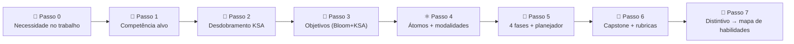

# 🚀 Modelo de Micro-Credencial ADA

Use este modelo para projetar um **Micro Curso (micro-credencial ADA)** que desenvolva
**qualquer habilidade que sua organização precise que alguém execute** — uma tarefa profissional
real, feita a um padrão real. Cada seção tem **\[instruções entre colchetes]**; substitua-as pelo
seu conteúdo. Exemplo completo:
[micro-credencial de Mentalidade de Crescimento](../../examples/growth-mindset-micro-credential/README.md) *(conteúdo em inglês)*.

---

## 🧭 Como usar este modelo — *de uma necessidade de habilidade a um curso em 7 passos*



1. **Passo 0 — Nomeie a necessidade** (abaixo): o que alguém precisa *fazer* no trabalho e como é "o bom"?
2. **Passo 1 — Ancore-a** a uma competência reconhecida (SFIA · O\*NET · ESCO · ILO).
3. **Passo 2 — Desdobre em KSA** — 🧠 Conhecimento, 🛠️ Habilidade, 🌱 Aptidão — para ensinar/avaliar cada parte corretamente.
4. **Passo 3 — Escreva objetivos Bloom**, cada um marcado com seu tipo KSA.
5. **Passo 4 — Projete 4–8 átomos de aprendizado**, escolhendo modalidades da topologia.
6. **Passo 5 / 6 — Sequencie as 4 fases**, depois adicione capstone + rubricas.
7. **Passo 7 — Emita um distintivo** que escreva níveis KSA em um mapa de habilidades para correspondência profissional.

> 🔗 Método detalhado para os Passos 0–2: [Mapeamento de Papel para Credencial](../../specs/role-to-credential-mapping.md)
> · Tipos e níveis KSA: [Taxonomia KSA](../../specs/ksa-taxonomy.md)
> · menu de modalidades: [Topologia do Átomo de Aprendizado](../../specs/learning-atom-topology.md).

---

## 🏢 Passo 0 — Necessidade de Habilidade Organizacional *(intake)*

Comece aqui. Descreva a **tarefa real** que você precisa que alguém execute — não um tema. Se você
puder observar uma pessoa de alto desempenho fazendo-a, melhor ainda (ver DACUM / shadowing no spec de mapeamento de papel).

| Pergunta de intake | Sua resposta |
| ------------------ | ------------ |
| **O que a pessoa precisa ser capaz de *fazer*?** (uma tarefa observável) | \[ex. "Facilitar um retro de incidentes sem culpa que produza ações corretivas"] |
| **Quem executa / em qual(is) papel(éis)?** | \[papel, equipe, senioridade] |
| **Por que importa** (resultado de negócio / custo da lacuna) | \[impacto se bem feito vs. malfeito] |
| **Como é "o bom"** (comportamento de alto desempenho, o padrão) | \[1–3 sinais observáveis de maestria] |
| **Referência a framework reconhecido** | \[competência SFIA · O\*NET · ESCO · ILO] |
| **Lacuna atual** (onde os aprendizes estão hoje) | \[o que ainda não conseguem fazer / fazem de forma inconsistente] |
| **Evidência de maestria** (como você saberá que conseguem fazer) | \[o artefato/comportamento que comprova] |

> ⚠️ Mapeamentos de habilidades assistidos por IA são **apoio à decisão** — peça a um mentor ou
> ao gestor de contratação que valide a tarefa, o padrão e a evidência antes de construir (humano no ciclo).

---

## 🎓 Título da Micro-Credencial

\[Escreva um título claro e alinhado com competências.]
**Exemplo:** *Resiliência Empresarial: Estratégias para Adaptar e Prosperar*

---

## ⏳ Duração Estimada

\[Defina a duração: horas ou semanas. As micro-credenciais ADA geralmente são de 10–30 horas.]
**Exemplo:** *15 horas · 3 semanas (5h/semana)*

---

## 🎯 Competência Profissional Alvo

\[Identifique a habilidade profissional do mundo real que o curso desenvolve, referenciando frameworks como SFIA, O\*NET, ou ESCO.]
**Exemplo:** *Capacidade de projetar e implementar estratégias de continuidade e resiliência empresarial.*

---

## 🧬 Passo 2 — Desdobramento KSA

Divida a competência em componentes tipificados. O **tipo decide como você ensina e avalia**:
Conhecimento → adquirir + questionário; Habilidade → praticar + rubrica de desempenho; Aptidão →
prática autêntica repetida + rubrica comportamental ao longo de várias ocasiões. Defina um nível
alvo **0–4** (ver [Taxonomia KSA](../../specs/ksa-taxonomy.md)).

| Tipo KSA | Componente (o que sabe / consegue fazer) | Por que este tipo | Nível alvo |
| -------- | ---------------------------------------- | ----------------- | ---------- |
| 🧠 Conhecimento | \[conceito / fato a compreender] | base habilitadora | \[0–4] |
| 🛠️ Habilidade | \[um procedimento concreto e praticável] | o *saber-fazer* | \[0–4] |
| 🌱 Aptidão | \[uma disposição / atitude duradoura] | comprovada pelo comportamento ao longo do tempo | \[0–4] |

> Uma "habilidade que alguém precisa executar" quase sempre precisa das **três**: um pouco de
> Conhecimento, a Habilidade central, e as Aptidões (julgamento, adaptabilidade, colaboração) que a consolidam.

---

## 🔑 Pré-requisitos

\[Liste o conhecimento, habilidades ou ferramentas que os aprendizes já devem ter. Se não houver nenhum, escreva "Nenhum."]

* [ ] \[Habilidade ou conhecimento #1]
* [ ] \[Habilidade ou conhecimento #2]

---

## 📘 Objetivos de Aprendizado

\[Defina 3–5 objetivos usando **verbos da taxonomia de Bloom**. Marque cada um com seu
**tipo KSA** (🧠 C / 🛠️ H / 🌱 A) para que a modalidade e a rubrica corretas sejam óbvias. Cada um será apoiado por Átomos de Aprendizado.]

**Exemplo (marcado):**

* 🧠 **Compreender** modelos de resiliência organizacional.
* 🛠️ **Projetar** uma estratégia de resiliência para um cenário de crise.
* 🌱 **Adaptar** decisões com calma à medida que as condições mudam (demonstrado em várias ocasiões).

**Exemplo:**

* **Compreender** modelos de resiliência organizacional.
* **Analisar** vulnerabilidades em ambientes em mudança.
* **Projetar** estratégias de resiliência para resposta a crises.
* **Avaliar** abordagens de liderança em contextos incertos.

---

## 💡 Habilidades a Serem Desenvolvidas (Competências Profissionais)

\[Liste 1–3 habilidades específicas e mensuráveis que os aprendizes serão capazes de demonstrar.]

**Exemplo:**

* Diagnosticar níveis de resiliência organizacional.
* Aplicar tomada de decisão adaptativa em contextos incertos.
* Criar um framework de resiliência para gestão de crises.
* Fomentar culturas organizacionais colaborativas e resilientes.

---

## ⚛ Átomos de Aprendizado

Cada **Átomo de Aprendizado** = *Conceito + Exemplo + Prática + Avaliação*
\[Projete 4–8 átomos, um por objetivo de aprendizado. Preencha os detalhes usando a tabela abaixo.]
Construa cada átomo a partir do [Modelo de Átomo de Aprendizado](modelo-atomo-aprendizado.md) e
escolha **modalidades** da [Topologia do Átomo de Aprendizado](../../specs/learning-atom-topology.md)
que se ajustem ao tipo KSA do átomo:

- 🧠 **Conhecimento** → 📖 Ler · 🎧 Escutar · 🎬 Assistir · 🖼️ Visualizar
- 🛠️ **Habilidade** → 🧪 Praticar (Lab · Codelab · Simulação) + rubrica de desempenho
- 🌱 **Aptidão** → 🖼️ Modelar · 🧪 Praticar · 🤝 Colaborar, em várias ocasiões

| Átomo  | Objetivo        | KSA | Modalidades (sub-tipos)             | Prática                  | Avaliar                              |
| ------ | --------------- | --- | ----------------------------------- | ------------------------ | ------------------------------------ |
| Átomo 1| \[Objetivo #1]  | \[🧠/🛠️/🌱] | \[ex. Artigo · Explainer · Diagrama] | \[Mini-laboratório ou exercício] | \[Questionário, reflexão, mini-rubrica] |
| Átomo 2| \[Objetivo #2]  | …   | …                                   | …                        | …                                    |

---

## 🔍 Fases de Aprendizado ADA

Cada fase usa **Átomos de Aprendizado** e segue a progressão de Confúcio: 

*ouvir → ver → fazer → compartilhar*.

---

### 🙉 Fase 1: Introdução Autoguiada

> *"Eu ouço e esqueço."  — Confúcio*

**Objetivo:** Introduzir conceitos através do autoaprendizado.
Inclui: 📖 leituras · 🎥 vídeos · 🎧 podcasts · 📚 estudos de caso · ❓ questionários

---

### 🙈 Fase 2: Exploração Visual

> *"Eu vejo e me lembro."  — Confúcio*

**Objetivo:** Reforçar o aprendizado visual e experimentalmente.
Inclui: 🧩 demonstrações · 🎞️ percursos · 🧪 interpretação de papéis · 📊 exploração de cenários

---

### 🙊 Fase 3: Prática Aplicada

> *"Eu faço e entendo."  — Confúcio*

**Objetivo:** Aplicar conhecimento em desafios práticos.
Inclui: 🧪 laboratórios práticos · 💻 tarefas de código · 🛠️ simulações · 📝 avaliação baseada em rubricas

---

### 🐵 Fase 4: Colaboração e Reflexão

> *"Eu compartilho e multiplico."  — Metodologia ADA*

**Objetivo:** Promover aprendizado colaborativo e reflexão.
Inclui: 👥 feedback entre pares · 🗣️ projetos de cocriação · 🌐 fóruns · 🎤 apresentações de showcase.

---

## 📋 Planejador de Conteúdo por Fases (Tabela Editável)

\[Use esta tabela para **listar o conteúdo, atividades e avaliações** para cada fase. Substitua os marcadores pelos detalhes do seu curso.]

| Fase                                 | Átomo(s) de Aprendizado | Conteúdo e Recursos                        | Atividade/Prática                         | Método de Avaliação                  |
| ------------------------------------ | ----------------------- | ------------------------------------------ | ----------------------------------------- | ------------------------------------ |
| Fase 1: Introdução Autoguiada       | \[Átomo #1, Átomo #2]  | \[Artigos, vídeos, podcasts]              | \[Prompt de reflexão, questionário curto] | \[Questionário, verificação P&R com IA] |
| Fase 2: Exploração Visual           | \[Átomo #2, Átomo #3]  | \[Animações, demos, cenário de interpretação] | \[Percurso guiado, discussão em grupo] | \[Feedback formativo]               |
| Fase 3: Prática Aplicada            | \[Átomo #3, Átomo #4]  | \[Manual de laboratório, ferramentas, datasets] | \[Laboratório prático, desafio de código] | \[Mini-rubrica + feedback]         |
| Fase 4: Colaboração e Reflexão      | \[Átomo #4]            | \[Brief do projeto, fórum entre pares]     | \[Apresentação capstone, revisão entre pares] | \[Rubrica capstone + feedback entre pares] |

---

## 🚀 Projeto Capstone

\[Projete um **projeto pronto para portfólio** que integre todas as habilidades do curso. Deve simular uma tarefa profissional real e ser avaliado com a rubrica abaixo.]

**Exemplo:**
*Os aprendizes criarão um **Plano de Resiliência Empresarial** para uma empresa, incluindo:*

1. **Relevância** → Alinhamento com necessidades de continuidade empresarial.
2. **Aplicação de Habilidades** → Uso de frameworks de resiliência.
3. **Resolução de Problemas e Criatividade** → Abordagens inovadoras para crises.
4. **Clareza e Comunicação** → Entregável claro e profissional.
5. **Colaboração e Reflexão** → Feedback entre pares e reflexão documentada.

---

## 📊 Avaliação e Valoração

* ✅ Questionários e prompts de reflexão por átomo (formativo)
* ✅ Feedback em laboratórios e mini-projetos (mini-rubrica)
* ✅ Projeto capstone avaliado com rubrica (somativo)
* ✅ Revisão entre pares e/ou mentor (opcional)

---

### 🔹 Mini-Rubrica para Laboratórios/Átomos (3 Critérios)

| Critério        | Excelente (3)                               | Adequado (2)                      | Precisa Melhorar (1)           |
| --------------- | ------------------------------------------- | --------------------------------- | ------------------------------ |
| **Precisão**    | Tarefa completada corretamente sem erros maiores | Principalmente correto, erros menores | Incorreto ou incompleto     |
| **Aplicação**   | Demonstra uso correto do conceito/ferramenta | Aplicação parcial, algumas lacunas | Aplicação fraca ou ausente  |
| **Clareza**     | Entrega clara e bem organizada              | Alguma clareza, precisa de melhorias | Pouco claro ou difícil de seguir |

> \[Use para laboratórios pequenos, exercícios de código ou tarefas de prática. Escala rápida de 3 pontos para velocidade.]

---

### 📋 Rubrica de Avaliação (Capstone — 5 Critérios)

O capstone é avaliado em **cinco critérios** ao longo de **quatro faixas de proficiência**,
ponderados para um total de **100 pontos**. A faixa de cada critério define quanto do seu peso é
obtido. Aprovação recomendada **≥ 70% no total, com pelo menos *Em Desenvolvimento* em cada
critério**, verificada por um mentor (humano no ciclo). É a rubrica padrão da ADA — reutilize-a em
todas as suas microcredenciais.

| Critérios | Excelente (100–90%) | Competente (89–80%) | Em Desenvolvimento (79–70%) | Inicial (69% ou menos) | Peso |
| :--- | :--- | :--- | :--- | :--- | :--- |
| **Relevância (Alinhamento com Competência Profissional)** | Totalmente alinhado com a competência profissional alvo em todos os momentos. | Principalmente alinhado, lacunas menores. | Parcialmente alinhado; lacunas notáveis. | Alinhamento fraco ou ausente. | **20 pts** |
| **Aplicação de Habilidades** | Uso avançado e correto das ferramentas/métodos. | Uso adequado, erros menores. | Uso inconsistente; vários erros. | Aplicação mínima ou incorreta. | **25 pts** |
| **Resolução de Problemas e Criatividade** | Soluções inovadoras e práticas. | Adequado mas convencional. | Originalidade limitada; em parte impraticável. | Pouca originalidade; impraticável. | **20 pts** |
| **Clareza e Comunicação** | Claro, bem estruturado, profissional. | Geralmente claro, problemas menores. | Clareza / estrutura irregular. | Pouco claro, mal estruturado. | **15 pts** |
| **Colaboração e Reflexão** | Forte engajamento entre pares + reflexão profunda. | Engajamento e reflexão moderados. | Engajamento / reflexão mínimos. | Ausente. | **20 pts** |
| **TOTAL** | | | | | **100 pts** |

---

### 📝 Rubrica de Avaliação em Branco (Capstone – Preencher)

\[Copie esta tabela e escreva um descritor em cada célula para a sua competência. Mantenha as
quatro faixas e ajuste os pesos para somar **100 pts**.]

| Critérios | Excelente (100–90%) | Competente (89–80%) | Em Desenvolvimento (79–70%) | Inicial (69% ou menos) | Peso |
| :--- | :--- | :--- | :--- | :--- | :--- |
| **\[Critério 1 — Relevância]** | \[Descrever maestria] | \[Descrever competente] | \[Descrever em desenvolvimento] | \[Descrever inicial] | **\[20 pts]** |
| **\[Critério 2 — Aplicação de Habilidades]** | \[Descrever] | \[Descrever] | \[Descrever] | \[Descrever] | **\[25 pts]** |
| **\[Critério 3 — Resolução de Problemas]** | \[Descrever] | \[Descrever] | \[Descrever] | \[Descrever] | **\[20 pts]** |
| **\[Critério 4 — Clareza e Comunicação]** | \[Descrever] | \[Descrever] | \[Descrever] | \[Descrever] | **\[15 pts]** |
| **\[Critério 5 — Colaboração e Reflexão]** | \[Descrever] | \[Descrever] | \[Descrever] | \[Descrever] | **\[20 pts]** |
| **TOTAL** | | | | | **100 pts** |

---

## 📦 Recursos de Apoio

\[Liste quaisquer datasets, ferramentas, código inicial, modelos ou guias que os aprendizes precisarão.]

* 📁 \[Datasets, APIs ou estudos de caso]
* 🧰 \[Notebooks iniciais ou modelos]
* 🧭 \[Instruções de configuração ou guias de ferramentas]

---

## 🏅 Passo 7 — Distintivo → Mapa de Habilidades *(correspondência profissional)*

Defina o distintivo para que a conclusão **escreva níveis KSA comprovados no mapa de habilidades do
aprendiz**, que pode então ser comparado com o mínimo exigido por qualquer vaga (ver
[Mapa de Habilidades e Correspondência Profissional](../../specs/skills-map-and-job-matching.md)).

```yaml
badge:
  name: "[Nome do distintivo — ex. Praticante de Resiliência]"
  evidence_required: ["[atomo-x]", "[atomo-y]", "capstone"]   # o que deve ser verificado
  issued_on: verified-evidence                                # assinatura de mentor/empregador
  components:                                                 # níveis KSA que certifica
    K-[id]: [0-4]
    S-[id]: [0-4]
    A-[id]: [0-4]
```

| A vaga pede… (obrigatório) | Este distintivo comprova | Match |
| -------------------------- | ------------------------ | ----- |
| \[habilidade / aptidão + nível mín.] | \[componente → nível alcançado] | ✅ / ⚠️ / ❌ |

---

## 🎓 Resultados e Reconhecimento

\[Defina o que os aprendizes obtêm no final.]

* Maestria conceitual de \[domínio/habilidade].
* Aplicação prática e pronta para o trabalho da **habilidade que sua organização precisa**.
* Projeto de portfólio para apresentar.
* **Distintivo digital** compatível com LinkedIn que atualiza o mapa de habilidades do aprendiz.

---

## ✅ Checklist de Conformidade de Design

Antes de publicar, confirme que o Micro Curso está **pronto para o trabalho e alinhado ao método**:

* [ ] O Passo 0 nomeia uma **tarefa real que alguém precisa executar**, com um "como é o bom" observável.
* [ ] A competência está ancorada em **SFIA / O\*NET / ESCO / ILO**.
* [ ] Cada objetivo é **verbo de Bloom + tipo KSA** (🧠/🛠️/🌱).
* [ ] **4–8 átomos**, cada um com modalidades escolhidas conforme seu tipo KSA.
* [ ] Aptidões/atitudes são avaliadas com uma **rubrica comportamental em várias ocasiões** (nunca um único questionário).
* [ ] Há um **capstone** que simula a tarefa real + uma rubrica de 5 critérios.
* [ ] O **distintivo** mapeia para níveis KSA e alimenta um **mapa de habilidades** para correspondência profissional.
* [ ] Um **mentor/empregador** validou a necessidade de habilidade e a evidência (humano no ciclo).
* [ ] Os recursos são atuais, acessíveis e devidamente licenciados.

---

## 👥 Créditos e Contribuidores

\[Adicione o(s) autor(es), mentores ou organização que criou a micro-credencial.]